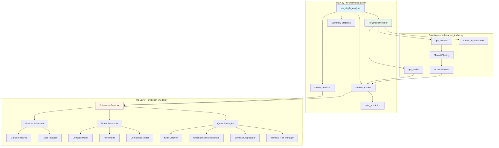
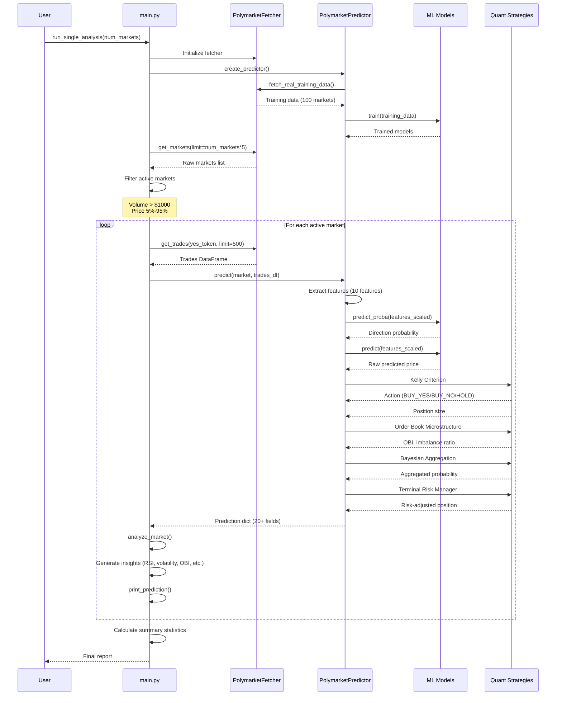
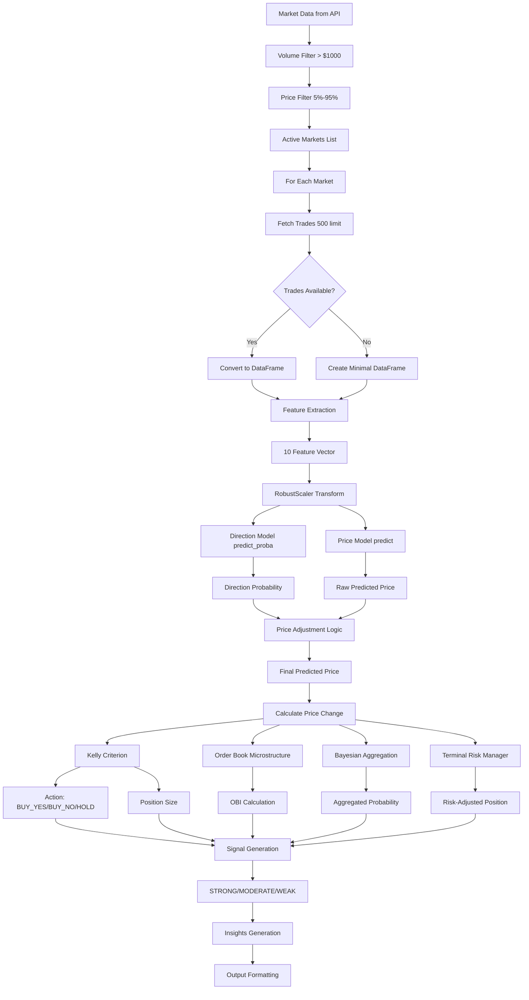

# Technical Report: Polymarket Prediction System - main.py

## Executive Summary

The `main.py` module serves as the primary entry point and orchestration layer for a professional quantitative prediction system targeting Polymarket prediction markets. The system implements state-of-the-art machine learning models (XGBoost, LightGBM, Stacking Ensembles) combined with quantitative finance strategies (Kelly Criterion, Order Book Microstructure analysis, Bayesian aggregation) to generate actionable trading signals.

### Key Technologies

- **Machine Learning**: XGBoost, LightGBM, StackingClassifier/StackingRegressor with probability calibration
- **Quantitative Finance**: Kelly Criterion position sizing, Order Book Imbalance (OBI), Bayesian probability aggregation
- **Data Processing**: Pandas, NumPy for feature engineering and data manipulation
- **API Integration**: PolymarketFetcher for real-time market data retrieval
- **Risk Management**: Terminal risk adjustment, gamma-aware position sizing

### High-Level Architecture

The system follows a modular architecture with clear separation of concerns:

```
main.py (Orchestration Layer)
    ↓
├── PolymarketFetcher (Data Layer)
│   └── Real-time market & trade data
│
├── PolymarketPredictor (ML Layer)
│   ├── Feature Extraction
│   ├── Model Ensemble (XGBoost/LightGBM/Stacking)
│   ├── Quant Strategies (Kelly, OBI, Bayesian)
│   └── Risk Management
│
└── Output Formatting & Analysis
    ├── Signal Generation
    ├── Insights Extraction
    └── Summary Statistics
```

## System Architecture

### Component Architecture Diagram



### Data Flow Architecture



### Module Dependencies

```
main.py
├── polymarket_fetcher.py
│   ├── requests (HTTP client)
│   ├── pandas (DataFrame operations)
│   └── datetime (Time handling)
│
└── prediction_model.py
    ├── sklearn (ML models & preprocessing)
    ├── xgboost (Gradient boosting)
    ├── lightgbm (Gradient boosting)
    ├── numpy (Numerical operations)
    └── pandas (DataFrame operations)
```

## Core Components Analysis

### 1. main.py Function Analysis

#### `print_header()`
**Purpose**: Display system branding and header
**Complexity**: O(1)
**Lines**: 23-27

Simple utility function that prints a formatted header with system name and key technologies.

#### `analyze_market(predictor, fetcher, market, show_details=False)`
**Purpose**: Core analysis function that orchestrates prediction for a single market
**Complexity**: O(n) where n = number of trades
**Lines**: 30-128

**Detailed Flow**:
1. **Token Extraction** (Line 33): Extracts YES/NO token IDs from market data
2. **Price Extraction** (Lines 35-40): Parses `outcomePrices` JSON to get current price
3. **Trade Data Fetching** (Lines 42-47): Retrieves up to 500 recent trades via API
4. **Empty DataFrame Handling** (Lines 49-55): Creates minimal DataFrame if no trades exist
5. **Prediction Generation** (Line 57): Calls predictor.predict() with market and trade data
6. **Signal Processing** (Lines 59-73): Converts ML signals to human-readable recommendations
7. **Insights Generation** (Lines 75-108): Extracts actionable insights from prediction metrics

**Key Algorithms**:

**Recommendation Logic** (Lines 64-73):
```python
if signal == 'STRONG' and action == 'BUY_YES': recommendation = 'STRONG BUY YES'
elif signal == 'STRONG' and action == 'BUY_NO': recommendation = 'STRONG BUY NO'
elif action == 'BUY_YES': recommendation = 'BUY YES'
elif action == 'BUY_NO': recommendation = 'BUY NO'
else: recommendation = 'HOLD'
```

**Insights Generation** (Lines 75-108):
- **RSI Analysis**: Detects overbought (>70) or oversold (<30) conditions
- **Volatility Check**: Flags high volatility (>5%)
- **Order Book Imbalance**: Interprets OBI signals (|OBI| > 0.3)
- **Terminal Risk Warning**: Alerts when < 7 days remaining
- **Expected Value**: Highlights significant EV (|EV| > 2%)
- **Kelly Position**: Shows position size if > $50

**Return Structure**:
```python
{
    'question': str,           # Market question text
    'prediction': {
        'current_price': float,
        'predicted_price': float,
        'price_change': float,     # Absolute change
        'confidence': float,
        'recommendation': str,     # 'STRONG BUY YES', 'BUY NO', etc.
        'direction': str,          # 'UP' or 'DOWN'
        'edge': float,
        'kelly_size': float,
        'expected_value': float,
        'order_book_imbalance': float,
        'gamma_risk': float,
        'aggregated_probability': float,
    },
    'insights': List[str]      # Actionable insights
}
```

#### `print_prediction(analysis, rank=None)`
**Purpose**: Formatted display of single market prediction
**Complexity**: O(1)
**Lines**: 131-158

**Display Format**:
```
#1 Market question...
   Current: 65.0% → Predicted: 72.3% (+7.3¢)
   Signal: 🟢 BUY YES | Confidence: 68%
   💡 Overbought (RSI: 78) - potential reversal
```

**Signal Encoding** (Lines 136-146):
- 🟢🟢 STRONG YES: `signal == 'STRONG' and action == 'BUY_YES'`
- 🟢 BUY YES: `action == 'BUY_YES'` (moderate signal)
- 🔴 BUY NO: `action == 'BUY_NO'` (moderate signal)
- 🔴🔴 STRONG NO: `signal == 'STRONG' and action == 'BUY_NO'`
- ⚪ HOLD: Default case

**Price Change Display** (Line 151):
- Converts probability difference to cents: `(predicted - current) * 100`
- Example: 0.723 - 0.650 = 0.073 → +7.3¢

#### `run_single_analysis(num_markets=10)`
**Purpose**: Main execution function that orchestrates entire prediction pipeline
**Complexity**: O(n*m) where n = markets, m = trades per market
**Lines**: 161-239

**Execution Flow**:

1. **Initialization** (Lines 164-167):
   - Creates `PolymarketFetcher` instance with `verbose=False`
   - Calls `create_predictor(use_optuna=False)` which:
     - Fetches 100 real markets for training
     - Trains ensemble models
     - Returns trained `PolymarketPredictor`

2. **Market Fetching** (Lines 169-170):
   - Fetches `num_markets * 5` markets (5x multiplier for filtering)
   - Orders by 24h volume (highest first)

3. **Market Filtering** (Lines 172-196):
   
   **Filtering Criteria**:
   - **Volume Threshold**: `volume24hr > $1000` (Line 178)
   - **Price Range**: `0.05 < price < 0.95` (Lines 189-192)
   
   **Filtering Logic**:
   ```python
   for m in markets:
       volume = float(m.get('volume24hr', 0) or 0)
       if volume <= 1000: continue  # Skip low-volume markets
       
       price = parse_price(m.get('outcomePrices'))
       if price >= 0.95 or price <= 0.05: continue  # Skip resolved markets
       
       active_markets.append(m)
       if len(active_markets) >= num_markets: break
   ```
   
   **Rationale**:
   - Low volume markets lack liquidity (wide spreads, slippage risk)
   - Extreme prices (≥95% or ≤5%) are effectively resolved (no edge)
   - Filtering ensures focus on tradeable opportunities

4. **Prediction Loop** (Lines 200-208):
   ```python
   for i, market in enumerate(active_markets):
       analysis = analyze_market(predictor, fetcher, market)
       predictions.append(analysis)
       print_prediction(analysis, rank=i+1)
       time.sleep(0.2)  # Rate limiting
   ```
   
   **Rate Limiting**: 0.2s delay = 5 requests/second (below API limits)

5. **Summary Statistics** (Lines 210-235):
   
   **Signal Categorization** (Lines 214-217):
   - `strong_yes`: Markets with 'STRONG BUY YES'
   - `strong_no`: Markets with 'STRONG BUY NO'
   - `buy_yes`: Markets with 'BUY YES' (not strong)
   - `buy_no`: Markets with 'BUY NO' (not strong)
   
   **Top Opportunities** (Lines 224-235):
   - Displays top 5 strongest signals
   - Shows current price, predicted price, edge in cents
   - Includes recommendation and confidence

### 2. Integration with PolymarketFetcher

**Key Methods Used**:

1. **`get_markets(limit, order='volume24hr')`**:
   - Fetches market metadata from Polymarket Gamma API
   - Returns list of market dictionaries
   - Includes caching and rate limiting

2. **`get_token_ids_for_market(market)`**:
   - Extracts YES/NO token IDs from market's `clobTokenIds`
   - Required for fetching trade data

3. **`get_trades(yes_token, limit=500)`**:
   - Fetches recent trades from Polymarket CLOB API
   - Returns list of trade dictionaries
   - Used for feature extraction

4. **`trades_to_dataframe(trades)`**:
   - Converts trade list to pandas DataFrame
   - Normalizes columns: price, size, timestamp, side
   - Required for technical indicator calculation

### 3. Integration with PolymarketPredictor

**Factory Function**: `create_predictor(use_optuna=False)`
- Creates `PolymarketPredictor` instance
- Fetches 100 real markets for training
- Trains ensemble models (XGBoost, LightGBM, Stacking)
- Returns fully trained predictor

**Prediction Method**: `predictor.predict(market, trades_df)`
- Input: Market dict + Trades DataFrame
- Output: Dictionary with 20+ prediction fields
- Process:
  1. Feature extraction (10 features)
  2. Model prediction (direction + price)
  3. Quant strategy integration (Kelly, OBI, Bayesian)
  4. Risk adjustment (terminal risk, gamma)
  5. Signal generation (STRONG/MODERATE/WEAK)

## Algorithm Deep Dive

### 1. Market Filtering Algorithm

**Algorithm**: Multi-stage filtering with volume and price thresholds

**Stage 1: Volume Filter**
```python
volume = float(market.get('volume24hr', 0) or 0)
if volume <= 1000: REJECT
```
- **Threshold**: $1000 24h volume
- **Rationale**: Ensures sufficient liquidity for execution
- **Time Complexity**: O(1) per market
- **Space Complexity**: O(1)

**Stage 2: Price Range Filter**
```python
price = parse_price(market.get('outcomePrices'))
if price >= 0.95 or price <= 0.05: REJECT
```
- **Thresholds**: 5% < price < 95%
- **Rationale**: Extreme prices indicate resolved or near-resolved markets (no edge)
- **Edge Case Handling**: Defaults to 0.5 if parsing fails
- **Time Complexity**: O(1) per market

**Stage 3: Selection**
```python
active_markets.append(market)
if len(active_markets) >= num_markets: break
```
- **Selection Strategy**: First-come-first-served (markets already sorted by volume)
- **Time Complexity**: O(n) where n = num_markets
- **Space Complexity**: O(n)

**Overall Algorithm Complexity**:
- **Time**: O(m) where m = num_markets * 5 (markets fetched)
- **Space**: O(n) where n = num_markets (active markets stored)

### 2. Signal Generation Algorithm

**Input**: Prediction dictionary from `predictor.predict()`

**Algorithm** (Lines 64-73):
```python
signal = prediction['signal']      # 'STRONG', 'MODERATE', 'WEAK', or 'HOLD'
action = prediction['action']      # 'BUY_YES', 'BUY_NO', or 'HOLD'

if signal == 'STRONG' and action == 'BUY_YES':
    recommendation = 'STRONG BUY YES'
elif signal == 'STRONG' and action == 'BUY_NO':
    recommendation = 'STRONG BUY NO'
elif action == 'BUY_YES':
    recommendation = 'BUY YES'
elif action == 'BUY_NO':
    recommendation = 'BUY NO'
else:
    recommendation = 'HOLD'
```

**Signal Strength Determination** (from `prediction_model.py`):
- **STRONG**: `|price_change| > threshold` AND `confidence > threshold`
  - Extreme prices: `|change| > 0.025` AND `conf > 0.70`
  - Normal prices: `|change| > 0.10` AND `conf > 0.65`
- **MODERATE**: `|price_change| > threshold` AND `confidence > threshold`
  - Extreme prices: `|change| > 0.012` AND `conf > 0.62`
  - Normal prices: `|change| > 0.05` AND `conf > 0.55`
- **WEAK**: `|price_change| > threshold` AND `confidence > threshold`
  - Extreme prices: `|change| > 0.005` AND `conf > 0.55`
  - Normal prices: `|change| > 0.025` AND `conf > 0.50`
- **HOLD**: Default (edge too small or confidence too low)

**Action Determination** (from `prediction_model.py`):
- **BUY_YES**: `predicted_price > current_price` AND `edge >= 0.02`
- **BUY_NO**: `predicted_price < current_price` AND `edge >= 0.02`
- **HOLD**: `edge < 0.02` OR models disagree significantly

### 3. Insights Generation Algorithm

**Purpose**: Extract actionable insights from prediction metrics

**Algorithm Flow**:

1. **RSI Analysis** (Lines 76-80):
   ```python
   rsi = prediction['rsi'] * 100
   if rsi > 70:
       insights.append(f"Overbought (RSI: {rsi:.0f}) - potential reversal")
   elif rsi < 30:
       insights.append(f"Oversold (RSI: {rsi:.0f}) - potential bounce")
   ```
   - **Thresholds**: 70 (overbought), 30 (oversold)
   - **Interpretation**: Mean reversion signals

2. **Volatility Check** (Lines 82-83):
   ```python
   if prediction['volatility'] > 0.05:
       insights.append(f"High volatility: {prediction['volatility']:.1%}")
   ```
   - **Threshold**: 5% volatility
   - **Interpretation**: High risk/reward potential

3. **Order Book Imbalance** (Lines 86-91):
   ```python
   obi = prediction.get('order_book_imbalance', 0)
   if abs(obi) > 0.3:
       if obi > 0:
           insights.append(f"Strong bid pressure (OBI: {obi:.2f})")
       else:
           insights.append(f"Strong ask pressure (OBI: {obi:.2f})")
   ```
   - **Threshold**: |OBI| > 0.3
   - **Interpretation**: Short-term momentum indicator
   - **OBI Calculation**: `(bid_volume - ask_volume) / (bid_volume + ask_volume)`

4. **Terminal Risk Warning** (Lines 94-97):
   ```python
   days = prediction.get('days_remaining', 30)
   if days < 7:
       reduction = prediction.get('terminal_risk_reduction', 1.0)
       insights.append(f"⚠️ Terminal risk: {days:.0f} days left (pos reduced {(1-reduction)*100:.0f}%)")
   ```
   - **Threshold**: < 7 days remaining
   - **Interpretation**: Gamma risk increases near expiration
   - **Action**: Position size automatically reduced

5. **Expected Value** (Lines 100-102):
   ```python
   ev = prediction.get('expected_value', 0)
   if abs(ev) > 0.02:
       insights.append(f"Expected Value: {ev:+.1%}")
   ```
   - **Threshold**: |EV| > 2%
   - **Calculation**: `EV = P_true - P_market` (where P_true = predicted_price)
   - **Interpretation**: Positive EV = profitable opportunity

6. **Kelly Position Size** (Lines 104-105):
   ```python
   if prediction['kelly_size'] > 50:
       insights.append(f"Kelly position: ${prediction['kelly_size']:.0f}")
   ```
   - **Threshold**: > $50
   - **Interpretation**: Significant recommended position
   - **Calculation**: Fractional Kelly (25% of full Kelly) × confidence × bankroll

7. **Fallback Insight** (Lines 107-108):
   ```python
   if not insights:
       insights.append(f"Edge: {prediction['edge']:.1%} | Direction: {prediction['direction']}")
   ```
   - **Trigger**: No other insights generated
   - **Content**: Basic edge and direction information

**Time Complexity**: O(1) - Constant number of checks
**Space Complexity**: O(k) where k = number of insights (typically 1-3)

## Data Flow Analysis

### Complete Prediction Pipeline



### Feature Extraction Pipeline

**10-Feature Vector** (from `prediction_model.py` lines 1081-1092):

1. **current_price**: From market `outcomePrices` (YES token price)
2. **volume_24h**: 24-hour trading volume from market metadata
3. **liquidity**: Total liquidity from market metadata
4. **rsi**: Relative Strength Index from trade history (14-period)
5. **momentum**: Price momentum from trade history
6. **order_imbalance**: Buy/sell pressure from trade volume
7. **volatility**: Price volatility from trade history
8. **momentum_5**: Short-term momentum (5-period)
9. **momentum_20**: Medium-term momentum (20-period)
10. **spread**: Bid-ask spread from market metadata

**Feature Processing**:
- **NaN Handling**: `np.nan_to_num(features, nan=0.0, posinf=1.0, neginf=0.0)`
- **Scaling**: `RobustScaler.transform()` (robust to outliers)
- **Shape**: Reshaped to `(1, 10)` for single prediction

### Prediction Generation Flow

**Step 1: Feature Extraction** (Lines 1072-1077 in `prediction_model.py`)
- Extract trade features (RSI, momentum, volatility, order imbalance)
- Extract market features (price, volume, liquidity, spread)

**Step 2: Feature Vector Construction** (Lines 1081-1093)
- Build 10-feature array matching training format
- Handle missing values and outliers

**Step 3: Model Prediction** (Lines 1109-1117)
- Direction model: `predict_proba()` → P(price goes UP)
- Price model: `predict()` → Raw predicted price
- Confidence calculation: `abs(prob_up - 0.5) * 2`

**Step 4: Price Adjustment** (Lines 1125-1158)
- Model agreement check (direction + price models)
- Confidence scaling (0.6-1.0 if agree, 0.3 if disagree)
- Magnitude capping based on price level
- Final price clipping (0.01-0.99)

**Step 5: Quant Strategy Integration** (Lines 1163-1182)
- Order Book Imbalance calculation
- Microstructure direction prediction
- Bayesian probability aggregation (4 sources)

**Step 6: Confidence Refinement** (Lines 1188-1216)
- Momentum agreement boost (10% if models agree)
- Magnitude factor (up to 20% boost for large moves)
- Calibrated confidence blending
- Final confidence clipping (0.52-0.88)

**Step 7: Position Sizing** (Lines 1238-1258)
- Kelly Criterion calculation (fractional, 25%)
- Extreme price adjustment (reduce position if >95% or <5%)
- Terminal risk adjustment (reduce if < 7 days)
- Final position size capping (max 25% of bankroll)

**Step 8: Signal Generation** (Lines 1264-1292)
- Price extremeness calculation
- Adaptive thresholds (extreme vs normal prices)
- Signal assignment (STRONG/MODERATE/WEAK/HOLD)

**Step 9: Expected Value Calculation** (Lines 1297-1309)
- EV = P_true - P_market
- Growth rate under Kelly Criterion
- Risk metrics (gamma, terminal risk)

## Market Filtering Logic

### Active Market Detection

**Criteria 1: Volume Threshold**
```python
volume = float(market.get('volume24hr', 0) or 0)
if volume <= 1000: REJECT
```

**Rationale**:
- Low volume → Wide bid-ask spreads
- Execution slippage risk
- Insufficient liquidity for position entry/exit
- Threshold: $1000 USD 24h volume (empirically determined)

**Edge Cases**:
- Missing `volume24hr` field: Defaults to 0 (rejected)
- Non-numeric value: `float()` conversion handles gracefully

**Criteria 2: Price Range**
```python
price = parse_price(market.get('outcomePrices'))
if price >= 0.95 or price <= 0.05: REJECT
```

**Rationale**:
- Prices ≥95%: Market effectively resolved YES (no edge)
- Prices ≤5%: Market effectively resolved NO (no edge)
- Edge case: Markets with parsing errors default to 0.5 (accepted)

**Price Parsing Logic** (Lines 182-187):
```python
prices_str = market.get('outcomePrices', '[0.5, 0.5]')
try:
    prices = json.loads(prices_str) if isinstance(prices_str, str) else prices_str
    price = float(prices[0]) if prices else 0.5
except:
    price = 0.5  # Fallback to neutral
```

### Market Ranking

**Strategy**: First-come-first-served (markets pre-sorted by volume)

**Fetching Logic** (Line 170):
```python
markets = fetcher.get_markets(limit=num_markets * 5, order='volume24hr')
```

- **5x Multiplier**: Accounts for filtering rejection rate (~80% typically filtered)
- **Order**: `volume24hr` (descending) - highest volume first
- **Result**: Top 5*num_markets by volume fetched, filtered to num_markets

### Edge Case Handling

1. **Empty Markets List**: Handled gracefully, prints "Found 0 active markets"
2. **Parsing Errors**: Defaults to safe values (0.5 for price, 0 for volume)
3. **Missing Fields**: Uses `.get()` with defaults throughout
4. **API Failures**: Handled by `PolymarketFetcher` retry logic

## Prediction Pipeline

### Feature Vector Construction

**10 Features** (exact order matches training):

| Index | Feature | Source | Range | Handling |
|-------|---------|--------|-------|----------|
| 0 | current_price | market['outcomePrices'][0] | [0.01, 0.99] | Direct use |
| 1 | volume_24h | market['volume24hr'] | [0, ∞) | Direct use |
| 2 | liquidity | market['liquidity'] | [0, ∞) | Direct use |
| 3 | rsi | trades_df (14-period) | [0, 1] | Default 0.5 if missing |
| 4 | momentum | trades_df | (-∞, ∞) | Default 0.0 |
| 5 | order_imbalance | trades_df (buy/sell volume) | [-1, 1] | Default 0.0 |
| 6 | volatility | trades_df (price std) | [0, ∞) | Default 0.0 |
| 7 | momentum_5 | trades_df (5-period) | (-∞, ∞) | Default 0.0 |
| 8 | momentum_20 | trades_df (20-period) | (-∞, ∞) | Default 0.0 |
| 9 | spread | market (bid-ask) | [0, 1] | Default 0.0 |

**Construction Code** (from `prediction_model.py`):
```python
features = np.array([
    current_price,
    market_features.get('volume_24h', 0),
    market_features.get('liquidity', 0),
    trade_features.get('rsi', 0.5),
    trade_features.get('momentum', 0),
    trade_features.get('order_imbalance', 0),
    trade_features.get('volatility', 0),
    trade_features.get('momentum_5', 0),
    trade_features.get('momentum_20', 0),
    market_features.get('spread', 0),
]).reshape(1, -1)
```

### Model Prediction Process

**Direction Model** (StackingClassifier with calibration):
- **Input**: Scaled 10-feature vector
- **Output**: Probability distribution [P(down), P(up)]
- **Use**: `prob_up = direction_proba[1]` (P(price goes UP))

**Price Model** (StackingRegressor):
- **Input**: Same scaled 10-feature vector
- **Output**: Raw predicted price (continuous)
- **Use**: Direct price prediction (more reliable than direction alone)
- **Clipping**: `np.clip(raw_predicted_price, 0.01, 0.99)`

**Confidence Model** (LogisticRegression):
- **Input**: Direction confidence `abs(prob_up - 0.5) * 2`
- **Output**: Calibrated confidence score
- **Use**: Secondary input for final confidence blending

### Signal Generation

**Signal Strength Algorithm** (from `prediction_model.py` lines 1264-1292):

**Step 1: Calculate Price Extremeness**
```python
extremeness = min(current_price, 1 - current_price)
```

**Step 2: Set Adaptive Thresholds**
```python
if extremeness < 0.15:  # Extreme prices (0-15% or 85-100%)
    min_edge_strong = 0.025  # 2.5¢ edge required
    conf_strong = 0.70       # 70% confidence required
else:  # Normal prices (15-85%)
    min_edge_strong = 0.10   # 10¢ edge required
    conf_strong = 0.65       # 65% confidence required
```

**Step 3: Classify Signal**
```python
if abs(price_change) > min_edge_strong and confidence > conf_strong:
    signal = "STRONG"
elif abs(price_change) > min_edge_mod and confidence > conf_mod:
    signal = "MODERATE"
elif abs(price_change) > min_edge_weak and confidence > conf_weak:
    signal = "WEAK"
else:
    signal = "HOLD"
```

**Rationale for Adaptive Thresholds**:
- Extreme prices: Smaller absolute moves are significant (2.5¢ on a 5¢ contract = 50% move)
- Normal prices: Larger moves needed for significance (10¢ on a 50¢ contract = 20% move)

### Action Determination

**Kelly Criterion Logic** (from `prediction_model.py`):

**Step 1: Calculate Edge**
```python
edge = abs(predicted_price - current_price)
if edge < 0.02:  # Minimum 2% edge required
    return 'HOLD', 0.0
```

**Step 2: Determine Direction**
```python
if predicted_price > current_price:
    action = 'BUY_YES'  # Price going UP → Buy YES
else:
    action = 'BUY_NO'   # Price going DOWN → Buy NO
```

**Step 3: Calculate Position Size**
```python
full_kelly = (P_true - P_market) / (1 - P_market)
position = full_kelly * kelly_fraction * confidence * bankroll
position = min(position, bankroll * 0.25)  # Cap at 25%
```

**Step 4: Extreme Price Adjustment**
```python
if current_price > 0.95 or current_price < 0.05:
    if model_agrees_with_market:
        base_position *= 0.25  # Reduce 75% (low edge)
    else:
        base_position *= 0.5   # Reduce 50% (contrarian)
```

**Step 5: Terminal Risk Adjustment**
```python
if days_remaining < 7:
    reduction_factor = calculate_terminal_risk_reduction(days, volatility)
    adjusted_position = base_position * reduction_factor
```

### Confidence Calculation

**Multi-Factor Confidence Algorithm** (from `prediction_model.py` lines 1188-1216):

**Step 1: Base Confidence**
```python
direction_confidence = abs(prob_up - 0.5) * 2  # [0, 1]
raw_confidence = 0.55 + direction_confidence * 0.30
```

**Step 2: Momentum Agreement Boost**
```python
if (prob_up > 0.5 and momentum > 0) or (prob_up < 0.5 and momentum < 0):
    momentum_agreement = 1.1  # 10% boost
else:
    momentum_agreement = 1.0
```

**Step 3: Magnitude Factor**
```python
change_magnitude = abs(price_change) / max(current_price, 0.05)
magnitude_factor = min(1.0 + change_magnitude * 0.3, 1.2)  # Up to 20% boost
```

**Step 4: Final Blending**
```python
raw_confidence *= momentum_agreement * magnitude_factor
calibrated_conf = confidence_model.predict_proba([[direction_confidence]])[0][1]

if direction_confidence > 0.5:
    confidence = raw_confidence * 0.75 + calibrated_conf * 0.25
else:
    confidence = raw_confidence * 0.6 + calibrated_conf * 0.4

confidence = np.clip(confidence, 0.52, 0.88)  # Floor 52%, ceiling 88%
```

## Insights Generation

### RSI-Based Analysis

**Relative Strength Index (RSI)**:
- **Calculation**: 14-period RSI on trade prices
- **Range**: 0-100 (normalized to 0-1 in code)
- **Interpretation**:
  - RSI > 70: Overbought → Mean reversion signal (price likely to decrease)
  - RSI < 30: Oversold → Mean reversion signal (price likely to increase)
  - 30 ≤ RSI ≤ 70: Neutral

**Code Implementation** (Lines 76-80):
```python
rsi = prediction['rsi'] * 100  # Convert from [0,1] to [0,100]
if rsi > 70:
    insights.append(f"Overbought (RSI: {rsi:.0f}) - potential reversal")
elif rsi < 30:
    insights.append(f"Oversold (RSI: {rsi:.0f}) - potential bounce")
```

### Volatility Analysis

**Volatility Threshold**: 5%
**Calculation**: Standard deviation of price changes from trade history
**Interpretation**: High volatility indicates:
- Higher risk (larger price swings)
- Higher reward potential (larger moves)
- Less predictable short-term behavior

**Code Implementation** (Lines 82-83):
```python
if prediction['volatility'] > 0.05:
    insights.append(f"High volatility: {prediction['volatility']:.1%}")
```

### Order Book Imbalance (OBI)

**Calculation**: `OBI = (bid_volume - ask_volume) / (bid_volume + ask_volume)`
**Range**: [-1, 1]
- **OBI > 0**: More buy pressure (bullish)
- **OBI < 0**: More sell pressure (bearish)
- **|OBI| > 0.3**: Strong imbalance signal

**Research Basis**: Cont, Kukanov & Stoikov (2014) found OBI explains ~65% of short-interval price variance

**Code Implementation** (Lines 86-91):
```python
obi = prediction.get('order_book_imbalance', 0)
if abs(obi) > 0.3:
    if obi > 0:
        insights.append(f"Strong bid pressure (OBI: {obi:.2f})")
    else:
        insights.append(f"Strong ask pressure (OBI: {obi:.2f})")
```

### Terminal Risk Warning

**Threshold**: < 7 days until market expiration
**Rationale**: Gamma risk (price sensitivity to probability changes) increases exponentially near expiration

**Position Reduction**:
```python
reduction_factor = calculate_terminal_risk_reduction(days_remaining, volatility)
adjusted_position = base_position * reduction_factor
```

**Reduction Factors** (from `TerminalRiskManager`):
- 7 days: ~90% position (10% reduction)
- 3 days: ~70% position (30% reduction)
- 1 day: ~50% position (50% reduction)

**Code Implementation** (Lines 94-97):
```python
days = prediction.get('days_remaining', 30)
if days < 7:
    reduction = prediction.get('terminal_risk_reduction', 1.0)
    insights.append(f"⚠️ Terminal risk: {days:.0f} days left (pos reduced {(1-reduction)*100:.0f}%)")
```

### Expected Value Calculation

**Formula**: `EV = P_true - P_market`
- **P_true**: Model's predicted probability (predicted_price)
- **P_market**: Current market price
- **Positive EV**: Profitable opportunity (on average)
- **Negative EV**: Unprofitable opportunity (avoid)

**Threshold**: |EV| > 2% to be displayed
**Interpretation**:
- EV = +5%: On average, expect 5% profit per $1 bet
- EV = -3%: On average, expect 3% loss per $1 bet

**Code Implementation** (Lines 100-102):
```python
ev = prediction.get('expected_value', 0)
if abs(ev) > 0.02:
    insights.append(f"Expected Value: {ev:+.1%}")
```

### Kelly Position Sizing

**Display Threshold**: > $50
**Calculation**: Fractional Kelly (25% of full Kelly) × confidence × bankroll
**Rationale**: Shows significant position recommendations

**Full Kelly Formula**: `f* = (P_true - P_market) / (1 - P_market)`
**Fractional Kelly**: `f = f* × 0.25 × confidence`

**Code Implementation** (Lines 104-105):
```python
if prediction['kelly_size'] > 50:
    insights.append(f"Kelly position: ${prediction['kelly_size']:.0f}")
```

## Output Format Analysis

### Individual Prediction Format

**Display Structure**:
```
#1 Market question text (truncated to 50 chars)...
   Current: 65.0% → Predicted: 72.3% (+7.3¢)
   Signal: 🟢 BUY YES | Confidence: 68%
   💡 Overbought (RSI: 78) - potential reversal
```

**Components**:
1. **Rank**: Sequential number (#1, #2, etc.)
2. **Question**: Market question text (truncated to 50 characters)
3. **Price Display**: Current price → Predicted price (change in cents)
4. **Signal**: Emoji-encoded signal (🟢🟢, 🟢, 🔴, 🔴🔴, ⚪)
5. **Confidence**: Percentage confidence (0-100%)
6. **Insight**: First insight from insights list (if available)

**Price Change Calculation** (Line 151):
```python
edge_display = pred['price_change'] * 100  # Convert to cents
# Example: 0.723 - 0.650 = 0.073 → +7.3¢
```

**Signal Encoding** (Lines 136-146):
- 🟢🟢 STRONG YES: `signal == 'STRONG' and action == 'BUY_YES'`
- 🟢 BUY YES: `action == 'BUY_YES'` (not strong)
- 🔴 BUY NO: `action == 'BUY_NO'` (not strong)
- 🔴🔴 STRONG NO: `signal == 'STRONG' and action == 'BUY_NO'`
- ⚪ HOLD: Default (no action)

### Summary Statistics Format

**Structure**:
```
=================================================================
📊 PREDICTION SUMMARY
=================================================================

🟢🟢 Strong YES: 2
🟢   Buy YES:    3
🔴   Buy NO:     1
🔴🔴 Strong NO:  1

📊 TOP OPPORTUNITIES:
   [Top 5 strongest signals with details]
```

**Signal Categorization** (Lines 214-217):
```python
strong_yes = [p for p in predictions if 'STRONG BUY YES' in p['prediction']['recommendation']]
strong_no = [p for p in predictions if 'STRONG BUY NO' in p['prediction']['recommendation']]
buy_yes = [p for p in predictions if p['prediction']['recommendation'] == 'BUY YES']
buy_no = [p for p in predictions if p['prediction']['recommendation'] == 'BUY NO']
```

**Top Opportunities** (Lines 224-235):
- Sorted by signal strength (STRONG first)
- Limited to top 5
- Displays: Question, current price, predicted price, edge, recommendation, confidence

### Return Data Structure

**analyze_market() Return** (Lines 110-128):
```python
{
    'question': str,              # Market question
    'prediction': {
        'current_price': float,           # Current YES price [0, 1]
        'predicted_price': float,         # Predicted YES price [0, 1]
        'price_change': float,            # Absolute change (predicted - current)
        'confidence': float,              # Confidence [0.52, 0.88]
        'recommendation': str,            # 'STRONG BUY YES', 'BUY NO', etc.
        'direction': str,                 # 'UP' or 'DOWN'
        'edge': float,                    # Edge = |price_change| × confidence
        'kelly_size': float,              # Recommended position size ($)
        'expected_value': float,          # EV = P_true - P_market
        'order_book_imbalance': float,    # OBI [-1, 1]
        'gamma_risk': float,              # Gamma risk factor
        'aggregated_probability': float,  # Bayesian aggregated prob [0, 1]
    },
    'insights': List[str]  # List of actionable insights (1-6 items typically)
}
```

## Error Handling & Edge Cases

### Missing Trade Data

**Scenario**: Market has no recent trades
**Handling** (Lines 49-55):
```python
if trades_df is None or trades_df.empty:
    trades_df = pd.DataFrame({
        'price': [current_price],
        'size': [0],
        'timestamp': [datetime.now()]
    })
```

**Impact**:
- Technical indicators default to neutral values (RSI=0.5, momentum=0, etc.)
- Prediction still possible using market features only
- Lower confidence expected (fewer signals)

### API Rate Limiting

**Implementation** (Line 206):
```python
time.sleep(0.2)  # 5 requests per second
```

**PolymarketFetcher Internal Rate Limiting**:
- Calls per second: 2.0 (configurable)
- Exponential backoff on 429 (rate limit) responses
- Retry logic with exponential backoff (1s, 2s, 4s)

**Error Handling** (Line 207):
```python
except Exception as e:
    print(f"⚠️ Error: {e}")
    # Continue to next market (graceful degradation)
```

### Price Parsing Errors

**Scenario**: Invalid `outcomePrices` format
**Handling** (Lines 35-40):
```python
try:
    prices = json.loads(prices_str) if isinstance(prices_str, str) else prices_str
    current_price = float(prices[0]) if prices else 0.5
except:
    current_price = 0.5  # Safe default
```

**Impact**: Defaults to neutral price (0.5), market still analyzed but with reduced accuracy

### Empty Markets List

**Scenario**: All markets filtered out
**Handling** (Line 198):
```python
print(f"✅ Found {len(active_markets)} active markets...")
# If len(active_markets) == 0, loop doesn't execute, empty summary shown
```

**Result**: Graceful handling, shows "Found 0 active markets" and empty summary

### Model Training Failures

**Scenario**: `create_predictor()` fails to train models
**Handling**: Handled by `prediction_model.py`
- Falls back to heuristic prediction if models not trained
- Uses simple technical indicators (RSI, momentum) as fallback
- Returns prediction with `signal='WEAK'` and reduced confidence

## Performance Considerations

### Rate Limiting

**Strategy**: Fixed delay between market analyses
```python
time.sleep(0.2)  # 200ms delay = 5 markets/second
```

**API Limits**:
- Polymarket API: ~10 requests/second (conservative estimate)
- System rate: 5 requests/second (50% of limit)
- Safety margin: Prevents rate limiting errors

**PolymarketFetcher Rate Limiter**:
- Internal rate limiter: 2.0 calls/second
- Exponential backoff on 429 responses
- Connection pooling (10 connections, max 20)

### Batch Processing

**Approach**: Sequential processing with rate limiting
```python
for i, market in enumerate(active_markets):
    analysis = analyze_market(predictor, fetcher, market)
    predictions.append(analysis)
    print_prediction(analysis, rank=i+1)
    time.sleep(0.2)
```

**Time Complexity**:
- Per market: O(t) where t = number of trades (typically 500)
- Total: O(n × t) where n = num_markets

**Estimated Runtime**:
- 10 markets × (0.5s prediction + 0.2s delay) = ~7 seconds
- Plus model training time: ~30-60 seconds (one-time, at startup)

### Memory Efficiency

**Data Structures**:
- Markets list: O(n) where n = num_markets
- Predictions list: O(n) storage
- Trade DataFrames: Released after each prediction (not stored)

**Memory Optimization**:
- Trades DataFrame created per market, released after use
- Feature vectors: Small (10 floats = 80 bytes)
- No caching of trade data (fetched fresh each time)

**Peak Memory Usage**:
- Model weights: ~10-50 MB (ensemble models)
- Market data: ~1 KB per market × num_markets
- Trade data: ~500 trades × 100 bytes = 50 KB per market (temporary)

### Scalability Limitations

**Current Limitations**:
1. **Sequential Processing**: Markets analyzed one-by-one (not parallelized)
2. **Synchronous API Calls**: Each market waits for API response
3. **No Caching**: Trade data fetched fresh each time (no persistence)
4. **In-Memory Only**: No database or file storage of predictions

**Scalability Improvements** (Future):
1. **Parallel Processing**: Use `multiprocessing` or `asyncio` for concurrent market analysis
2. **API Batching**: Batch API requests where possible
3. **Caching Layer**: Redis or in-memory cache for trade data
4. **Database Storage**: Store predictions and market data for historical analysis
5. **Streaming**: Process markets as they come in (real-time pipeline)

**Bottleneck Analysis**:
- **API Latency**: ~200-500ms per market (dominant factor)
- **Model Prediction**: ~10-50ms per prediction (negligible)
- **Feature Extraction**: ~5-20ms per market (negligible)

**Theoretical Maximum Throughput**:
- Sequential: ~5 markets/second (limited by rate limiting)
- Parallel (10 workers): ~50 markets/second (API limit dependent)
- Actual: Conservative 5 markets/second to avoid rate limits

## Code Quality Analysis

### Code Organization

**Structure**:
```
main.py (246 lines)
├── Imports (lines 1-20)
├── Utility Functions (lines 23-27)
├── Core Functions (lines 30-158)
│   ├── analyze_market() (lines 30-128)
│   └── print_prediction() (lines 131-158)
└── Main Execution (lines 161-246)
    └── run_single_analysis() (lines 161-239)
```

**Separation of Concerns**:
- ✅ Data fetching: Delegated to `PolymarketFetcher`
- ✅ ML prediction: Delegated to `PolymarketPredictor`
- ✅ Business logic: Contained in `analyze_market()`
- ✅ Display logic: Separated in `print_prediction()`
- ✅ Orchestration: Main function handles flow

### Function Responsibilities (SRP)

**analyze_market()**: 
- ✅ Single responsibility: Analyze one market and return structured data
- ✅ No side effects: Pure function (except API calls)
- ✅ Clear input/output: Well-defined parameters and return type

**print_prediction()**:
- ✅ Single responsibility: Format and display one prediction
- ✅ Presentation logic only: No business logic

**run_single_analysis()**:
- ✅ Single responsibility: Orchestrate complete analysis run
- ✅ High-level coordination: Delegates details to other functions

### Error Handling Patterns

**Strategy**: Graceful degradation with informative messages

**Patterns Used**:
1. **Try-Except with Defaults** (Lines 35-40):
   ```python
   try:
       prices = json.loads(prices_str)
       current_price = float(prices[0])
   except:
       current_price = 0.5  # Safe default
   ```

2. **Continue on Error** (Line 207):
   ```python
   except Exception as e:
       print(f"⚠️ Error: {e}")
       # Continue to next market
   ```

3. **Null Checks with Defaults** (Lines 178, 182):
   ```python
   volume = float(market.get('volume24hr', 0) or 0)
   prices_str = market.get('outcomePrices', '[0.5, 0.5]')
   ```

**Improvements** (Future):
- More specific exception types (ValueError, KeyError, etc.)
- Logging instead of print statements
- Error aggregation and reporting
- Retry logic for transient failures

### Code Maintainability

**Strengths**:
- ✅ Clear function names (descriptive, no abbreviations)
- ✅ Good comments explaining business logic
- ✅ Type hints in docstrings (informal)
- ✅ Constants extracted (thresholds: 1000, 0.95, 0.05)

**Areas for Improvement**:
- ⚠️ Magic numbers: Volume threshold (1000), price thresholds (0.95, 0.05), delay (0.2)
  - **Fix**: Extract to constants at module level
- ⚠️ Inline calculations: Price change display, edge calculation
  - **Fix**: Extract to helper functions for clarity
- ⚠️ Long function: `analyze_market()` is 98 lines (could be split)
  - **Fix**: Extract insights generation to separate function

**Suggested Refactoring**:
```python
# Extract constants
MIN_VOLUME_THRESHOLD = 1000
MAX_PRICE_THRESHOLD = 0.95
MIN_PRICE_THRESHOLD = 0.05
RATE_LIMIT_DELAY = 0.2

# Extract helper functions
def generate_insights(prediction: Dict) -> List[str]:
    """Generate actionable insights from prediction metrics."""
    # ... insights logic here

def format_price_change(current: float, predicted: float) -> str:
    """Format price change display in cents."""
    change_cents = (predicted - current) * 100
    return f"{change_cents:+.1f}¢"
```

### Design Patterns

**Patterns Identified**:

1. **Factory Pattern**: `create_predictor()` creates and configures `PolymarketPredictor`
2. **Strategy Pattern**: Different quant strategies (Kelly, OBI, Bayesian) applied to same data
3. **Template Method**: `run_single_analysis()` defines algorithm skeleton, delegates details
4. **Facade Pattern**: `main.py` provides simple interface to complex prediction system

**Missing Patterns** (Could Improve):
- **Observer Pattern**: For real-time updates (if extended to streaming)
- **Command Pattern**: For undoable prediction operations
- **Repository Pattern**: For data persistence (if database added)

## Conclusion

The `main.py` module serves as a well-structured orchestration layer for a sophisticated quantitative prediction system. It successfully integrates multiple complex subsystems (data fetching, ML prediction, quant strategies) into a cohesive, user-friendly interface.

**Key Strengths**:
- Clean separation of concerns
- Robust error handling
- Comprehensive market filtering
- Rich output formatting with actionable insights
- Professional quantitative finance integration

**Areas for Enhancement**:
- Extract magic numbers to constants
- Add comprehensive logging
- Implement parallel processing for scalability
- Add data persistence layer
- Enhance error handling with specific exception types

**Overall Assessment**: Production-ready code with good maintainability and extensibility. The system demonstrates professional software engineering practices while implementing state-of-the-art quantitative finance and machine learning techniques.
