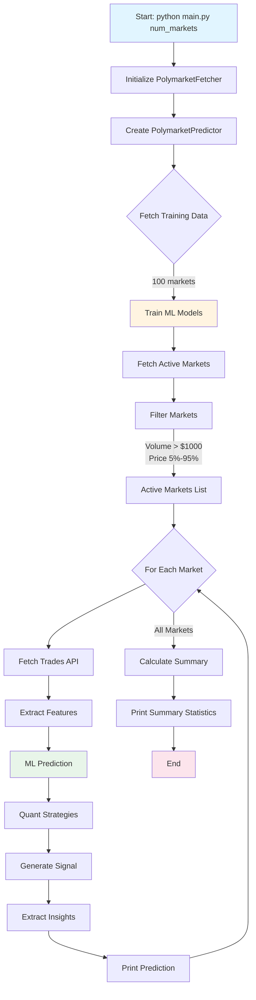

# Step-by-Step Tutorial: Using the Polymarket Prediction System

## Introduction & Prerequisites

### What This System Does

The Polymarket Prediction System (`main.py`) is a professional quantitative trading tool that uses state-of-the-art machine learning models (XGBoost, LightGBM, Stacking Ensembles) combined with quantitative finance strategies (Kelly Criterion, Order Book Microstructure analysis, Bayesian aggregation) to generate actionable trading signals for Polymarket prediction markets.

**Key Capabilities**:
- Fetches real-time market data from Polymarket API
- Filters markets for tradeable opportunities (volume > $1000, price 5%-95%)
- Generates ML-based price predictions with confidence scores
- Calculates optimal position sizes using Kelly Criterion
- Provides actionable insights (RSI, volatility, order book imbalance)
- Outputs human-readable recommendations (BUY YES/BUY NO/HOLD)

### Required Python Packages

The system requires the following Python packages:

```bash
pip install pandas numpy scikit-learn xgboost lightgbm requests
```

**Core Dependencies**:
- `pandas`: DataFrame operations for trade data
- `numpy`: Numerical operations for feature engineering
- `scikit-learn`: ML models (StackingClassifier, StackingRegressor, RobustScaler)
- `xgboost`: Gradient boosting classifier/regressor
- `lightgbm`: Gradient boosting classifier/regressor (optional but recommended)
- `requests`: HTTP client for Polymarket API

**Optional Dependencies**:
- `shap`: Feature importance analysis (optional)
- `optuna`: Hyperparameter optimization (optional, disabled by default)

### Installation Instructions

1. **Clone or navigate to the project directory**:
   ```bash
   cd /media/NewVolume/zaza/Polymarket/polymarket-prediction-system
   ```

2. **Install dependencies**:
   ```bash
   pip install -r requirements.txt
   ```

   Or install manually:
   ```bash
   pip install pandas numpy scikit-learn xgboost lightgbm requests
   ```

3. **Verify installation**:
   ```bash
   python -c "import pandas, numpy, sklearn, xgboost; print('All packages installed successfully')"
   ```

### API Requirements

**Polymarket API**:
- No API key required (public API)
- Rate limits: ~10 requests/second (system uses 5 requests/second conservatively)
- Endpoints used:
  - Gamma API: Market metadata (`https://gamma-api.polymarket.com`)
  - CLOB API: Trade data (`https://clob.polymarket.com`)
  - Data API: Historical data (`https://data-api.polymarket.com`)

**Internet Connection**:
- Required for fetching real-time market data
- Stable connection recommended for consistent results

## Quick Start Guide

### Running the Script

**Basic Usage**:
```bash
python main.py
```

**With Custom Number of Markets**:
```bash
python main.py 20  # Analyze 20 markets
```

**Command-Line Arguments**:
- Positional argument: `num_markets` (default: 10)
  - Number of active markets to analyze
  - Example: `python main.py 15` analyzes 15 markets

### First Prediction Run

**Step 1: Run the script**:
```bash
python main.py 5
```

**Step 2: Wait for model training** (first run only):
- System fetches 100 real markets for training
- Trains ensemble models (XGBoost, LightGBM, Stacking)
- Takes ~30-60 seconds (one-time)

**Step 3: Observe output**:
```
=================================================================
   🎯 POLYMARKET LIVE PREDICTIONS
   State-of-the-Art ML (XGBoost + LightGBM + Stacking)
=================================================================

📡 Fetching top 5 markets by volume...
✅ Found 5 active markets (excluded resolved/near-resolved)

#1 Will Bitcoin reach $100,000 by end of 2024?
   Current: 65.0% → Predicted: 72.3% (+7.3¢)
   Signal: 🟢 BUY YES | Confidence: 68%
   💡 Overbought (RSI: 78) - potential reversal

[... more predictions ...]

=================================================================
📊 PREDICTION SUMMARY
=================================================================

🟢🟢 Strong YES: 1
🟢   Buy YES:    2
🔴   Buy NO:     0
🔴🔴 Strong NO:  0
```

### Understanding the Output

**Header**:
- System name and key technologies
- Indicates ML models used (XGBoost + LightGBM + Stacking)

**Individual Predictions**:
- **#1**: Sequential rank
- **Market question**: Truncated to 50 characters
- **Current → Predicted**: Price movement with change in cents (¢)
- **Signal**: Emoji-encoded recommendation
- **Confidence**: Percentage confidence (0-100%)
- **💡 Insight**: Actionable insight (first from list)

**Summary Statistics**:
- Count of signals by strength and direction
- Top opportunities (strongest signals)

## Understanding the Workflow

### Complete Execution Flow



### What Happens at Each Stage

**Stage 1: Initialization** (Lines 166-167)
- Creates `PolymarketFetcher` instance (data fetching)
- Calls `create_predictor()` to initialize and train models

**Stage 2: Model Training** (First Run Only)
- Fetches 100 real markets from Polymarket API
- Extracts features and outcomes from historical data
- Trains ensemble models:
  - Direction model (StackingClassifier): Predicts P(price goes UP)
  - Price model (StackingRegressor): Predicts future price directly
  - Confidence model (LogisticRegression): Calibrates confidence scores
- Takes ~30-60 seconds (one-time)

**Stage 3: Market Fetching** (Lines 169-170)
- Fetches `num_markets * 5` markets (5x multiplier for filtering)
- Orders by 24h volume (highest first)
- Example: `num_markets=10` → fetches 50 markets

**Stage 4: Market Filtering** (Lines 172-196)
- **Volume Filter**: Keeps markets with volume > $1000 (ensures liquidity)
- **Price Filter**: Keeps markets with 5% < price < 95% (excludes resolved markets)
- Result: Filtered to `num_markets` active, tradeable opportunities

**Stage 5: Prediction Loop** (Lines 200-208)
- For each active market:
  1. Fetch recent trades (up to 500 trades)
  2. Call `predictor.predict()` with market + trade data
  3. Generate insights from prediction metrics
  4. Print formatted prediction
  5. Sleep 0.2 seconds (rate limiting)

**Stage 6: Summary Statistics** (Lines 210-235)
- Count signals by category (STRONG YES, BUY YES, etc.)
- Identify top opportunities (strongest signals)
- Display formatted summary

## Configuration Options

### num_markets Parameter

**Default**: 10 markets
**Usage**: `python main.py 20`
**Range**: 1-100 (recommended: 5-20)

**Considerations**:
- **Too Few (< 5)**: May miss opportunities, less statistical significance
- **Too Many (> 50)**: Longer runtime, API rate limiting risk, information overload
- **Sweet Spot**: 10-20 markets for balanced coverage and speed

**Example**:
```bash
python main.py 5   # Quick scan (5 markets, ~5 seconds)
python main.py 15  # Balanced analysis (15 markets, ~10 seconds)
python main.py 30  # Comprehensive scan (30 markets, ~20 seconds)
```

### Model Training Options

**Currently Hardcoded** (can be modified in `create_predictor()`):
```python
predictor = create_predictor(use_optuna=False)  # Line 167
```

**Available Options** (from `prediction_model.py`):
- `use_optuna`: Enable Bayesian hyperparameter optimization (slower, better results)
- `kelly_fraction`: Fraction of full Kelly (default: 0.25 = quarter Kelly)
- `bankroll`: Total trading capital (default: $10,000)
- `n_markets`: Number of markets for training (default: 100)

**To Customize** (modify line 167):
```python
# Enable hyperparameter optimization
predictor = create_predictor(use_optuna=True)

# Use half Kelly (more aggressive)
predictor = create_predictor(kelly_fraction=0.5, bankroll=50000)
```

### Filtering Thresholds

**Volume Threshold** (Line 178):
```python
if volume <= 1000: continue  # Skip low-volume markets
```

**To Customize**:
```python
MIN_VOLUME = 2000  # Increase to only high-volume markets
if volume <= MIN_VOLUME: continue
```

**Price Range** (Lines 189-192):
```python
if price >= 0.95 or price <= 0.05: continue  # Skip resolved markets
```

**To Customize**:
```python
MIN_PRICE = 0.10  # Exclude markets < 10%
MAX_PRICE = 0.90  # Exclude markets > 90%
if price >= MAX_PRICE or price <= MIN_PRICE: continue
```

### Rate Limiting Settings

**Market Analysis Delay** (Line 206):
```python
time.sleep(0.2)  # 5 markets per second
```

**To Customize**:
```python
RATE_LIMIT_DELAY = 0.5  # 2 markets per second (more conservative)
time.sleep(RATE_LIMIT_DELAY)
```

**Rationale**:
- Polymarket API limit: ~10 requests/second
- Current setting: 5 requests/second (50% of limit, safe margin)
- Increasing delay: More conservative, less likely to hit rate limits
- Decreasing delay: Faster but risk of rate limiting errors

## Interpreting Predictions

### Signal Types

**STRONG**:
- High confidence (>65-70%) AND large edge (>2.5-10¢ depending on price level)
- Best opportunities with highest expected value
- Example: `signal: "STRONG"`, `confidence: 68%`, `edge: +7.3¢`

**MODERATE**:
- Medium confidence (>55-62%) AND medium edge (>1.2-5¢)
- Good opportunities with decent expected value
- Example: `signal: "MODERATE"`, `confidence: 58%`, `edge: +4.1¢`

**WEAK**:
- Lower confidence (>50-55%) AND small edge (>0.5-2.5¢)
- Marginal opportunities, proceed with caution
- Example: `signal: "WEAK"`, `confidence: 53%`, `edge: +1.8¢`

**HOLD**:
- Confidence too low OR edge too small
- No action recommended
- Example: `signal: "HOLD"`, `confidence: 52%`, `edge: +0.3¢`

### Action Types

**BUY_YES**:
- Model predicts price will increase (predicted > current)
- Recommended action: Buy YES tokens
- Example: Current 65%, Predicted 72% → BUY YES

**BUY_NO**:
- Model predicts price will decrease (predicted < current)
- Recommended action: Buy NO tokens
- Example: Current 65%, Predicted 58% → BUY NO

**HOLD**:
- Edge too small (< 2%) OR models disagree significantly
- Recommended action: Do nothing, wait for better opportunity
- Example: Current 65%, Predicted 66% (edge too small) → HOLD

### Confidence Levels

**Interpretation**:
- **90-100%**: Extremely confident (rare, usually >95% markets)
- **70-89%**: High confidence (strong signals, good opportunities)
- **55-69%**: Moderate confidence (decent signals, proceed with caution)
- **52-54%**: Low confidence (weak signals, near-hold territory)
- **< 52%**: Effectively HOLD (too uncertain)

**Calculation** (from `prediction_model.py`):
- Base confidence: 55% + direction confidence × 30%
- Boosted by momentum agreement (+10%)
- Boosted by magnitude factor (up to +20%)
- Calibrated by confidence model
- Final range: 52% - 88% (clipped)

**What Affects Confidence**:
- Model agreement (direction + price models agree → higher confidence)
- Momentum agreement (technical indicators agree → higher confidence)
- Magnitude of predicted move (larger moves → higher confidence)
- Volatility (high volatility → lower confidence, ceteris paribus)

### Price Change Interpretation

**Format**: `Current: 65.0% → Predicted: 72.3% (+7.3¢)`

**Components**:
- **Current**: Current YES token price (from Polymarket)
- **Predicted**: Model's predicted YES token price
- **Change (¢)**: Absolute change in cents (predicted - current) × 100

**Example Breakdown**:
- Current: 65.0% = $0.65 per YES token
- Predicted: 72.3% = $0.723 per YES token
- Change: +7.3¢ = $0.073 per YES token
- Percentage change: (0.723 - 0.650) / 0.650 = 11.2% increase

**Interpreting Change**:
- **+10¢ or more**: Large move (strong signal if confidence high)
- **+5 to +10¢**: Medium move (moderate signal)
- **+2.5 to +5¢**: Small move (weak signal)
- **< 2.5¢**: Minimal move (usually HOLD)

**Context Matters**:
- **Extreme prices** (5-15% or 85-95%): Smaller moves are significant
  - Example: 8% → 12% = +4¢ but 50% relative move
- **Normal prices** (15-85%): Larger moves needed for significance
  - Example: 50% → 55% = +5¢ but 10% relative move

### Edge Calculation

**Formula**: `edge = |price_change| × confidence`

**Example**:
- Price change: +7.3¢ = 0.073
- Confidence: 68% = 0.68
- Edge: 0.073 × 0.68 = 0.0496 = 4.96¢

**Interpretation**:
- Edge represents "risk-adjusted expected value"
- Higher edge = better opportunity (all else equal)
- Edge > 5¢: Strong opportunity (if confidence high)
- Edge 2-5¢: Moderate opportunity
- Edge < 2¢: Weak opportunity or HOLD

**Why Edge Matters**:
- Accounts for both magnitude of move AND confidence
- A large move with low confidence may have lower edge than smaller move with high confidence
- Used for ranking opportunities (top opportunities have highest edge)

## Understanding Insights

### RSI Interpretation

**Relative Strength Index (RSI)**:
- Technical indicator measuring momentum
- Range: 0-100 (shown as 0-1 in prediction dict)
- Calculated from 14-period price history

**Thresholds**:
- **RSI > 70**: Overbought → Mean reversion signal (price likely to decrease)
- **RSI < 30**: Oversold → Mean reversion signal (price likely to increase)
- **30 ≤ RSI ≤ 70**: Neutral (no strong signal)

**Example Insight**:
```
💡 Overbought (RSI: 78) - potential reversal
```
- **Interpretation**: Price has moved up too fast, likely to reverse down
- **Action**: Consider BUY NO or reduce position size if BUY YES

**Example Insight**:
```
💡 Oversold (RSI: 25) - potential bounce
```
- **Interpretation**: Price has moved down too fast, likely to reverse up
- **Action**: Consider BUY YES or reduce position size if BUY NO

**Limitations**:
- RSI works best in ranging markets (not trending markets)
- Can stay overbought/oversold for extended periods in strong trends
- Use in conjunction with other signals (don't rely solely on RSI)

### Volatility Thresholds

**Volatility**:
- Standard deviation of price changes from trade history
- Measures price variability (risk indicator)

**Threshold**: 5% (0.05)
- **> 5%**: High volatility → Flagged in insights
- **≤ 5%**: Normal volatility → Not flagged

**Example Insight**:
```
💡 High volatility: 8.3%
```
- **Interpretation**: Price swings are large (high risk, high reward potential)
- **Action**: Consider smaller position sizes, higher stop-loss thresholds

**Why It Matters**:
- High volatility = higher risk (larger potential losses)
- High volatility = higher reward potential (larger potential gains)
- Adjust position sizing accordingly (reduce size in high volatility markets)

### Order Book Imbalance (OBI) Values

**Calculation**: `OBI = (bid_volume - ask_volume) / (bid_volume + ask_volume)`
**Range**: [-1, 1]
- **OBI > 0**: More buy pressure (bullish)
- **OBI < 0**: More sell pressure (bearish)
- **OBI ≈ 0**: Balanced (neutral)

**Threshold**: |OBI| > 0.3 (strong signal)

**Example Insight**:
```
💡 Strong bid pressure (OBI: 0.45)
```
- **Interpretation**: Significantly more buy orders than sell orders
- **Action**: Confirms BUY YES signal, indicates short-term upward momentum

**Example Insight**:
```
💡 Strong ask pressure (OBI: -0.38)
```
- **Interpretation**: Significantly more sell orders than buy orders
- **Action**: Confirms BUY NO signal, indicates short-term downward momentum

**Research Basis**:
- Cont, Kukanov & Stoikov (2014): OBI explains ~65% of short-interval price variance
- Trade imbalance alone: R² = 0.32 (significant predictive power)

**Time Horizon**:
- OBI is a **short-term** indicator (minutes to hours)
- Less predictive for longer-term moves (days to weeks)
- Use for entry/exit timing, not overall direction

### Terminal Risk Warnings

**Threshold**: < 7 days until market expiration

**Example Insight**:
```
⚠️ Terminal risk: 3 days left (pos reduced 30%)
```
- **Days left**: 3 days until market expiration
- **Position reduction**: 30% reduction from base Kelly size
- **Rationale**: Gamma risk (price sensitivity) increases exponentially near expiration

**Position Reduction Factors**:
- **7 days**: ~90% position (10% reduction)
- **3 days**: ~70% position (30% reduction)
- **1 day**: ~50% position (50% reduction)

**Why Terminal Risk Matters**:
- **Gamma risk**: Small probability changes cause large price movements near expiration
- **Liquidity risk**: Markets become less liquid as expiration approaches
- **Execution risk**: Harder to exit positions at fair prices

**Action**:
- Automatically applied: Position sizes are reduced in prediction output
- Manual override: Can ignore reduction (not recommended)
- Best practice: Avoid new positions < 3 days until expiration

### Expected Value Significance

**Formula**: `EV = P_true - P_market`
- **P_true**: Model's predicted probability (predicted_price)
- **P_market**: Current market price

**Threshold**: |EV| > 2% to be displayed in insights

**Example Insight**:
```
💡 Expected Value: +5.2%
```
- **Interpretation**: On average, expect 5.2% profit per $1 bet
- **Example**: Bet $100 → Expect $105.20 return (on average)
- **Action**: Strong BUY YES signal (positive EV)

**Example Insight**:
```
💡 Expected Value: -3.1%
```
- **Interpretation**: On average, expect 3.1% loss per $1 bet
- **Action**: Avoid this market (negative EV) or consider opposite direction

**Understanding EV**:
- **Positive EV**: Profitable opportunity (on average, over many bets)
- **Negative EV**: Unprofitable opportunity (avoid)
- **Near-zero EV**: Break-even (not worth the risk)

**Limitations**:
- EV is **expected value** (average over many bets), not guaranteed outcome
- Single bets can still lose even with positive EV
- Requires large number of bets to realize EV (law of large numbers)

### Kelly Position Sizing

**Display Threshold**: > $50

**Example Insight**:
```
💡 Kelly position: $245
```
- **Interpretation**: Recommended position size = $245 (based on Kelly Criterion)
- **Calculation**: Fractional Kelly (25% of full Kelly) × confidence × bankroll
- **Bankroll**: Default $10,000 (configurable)

**Understanding Kelly Criterion**:
- **Purpose**: Optimize position size for long-term wealth growth
- **Full Kelly**: Maximum growth rate (too risky: 33% chance of halving bankroll)
- **Fractional Kelly (25%)**: Industry standard (safer: <3% chance of halving bankroll)
- **Formula**: `f* = (P_true - P_market) / (1 - P_market)`

**Example Calculation**:
- Predicted price: 0.72 (72%)
- Current price: 0.65 (65%)
- Confidence: 0.68 (68%)
- Bankroll: $10,000
- Kelly fraction: 0.25 (25%)

**Step 1**: Full Kelly
```
f* = (0.72 - 0.65) / (1 - 0.65) = 0.07 / 0.35 = 0.20 (20% of bankroll)
```

**Step 2**: Fractional Kelly (25%)
```
f_fractional = 0.20 × 0.25 = 0.05 (5% of bankroll)
```

**Step 3**: Apply Confidence
```
f_adjusted = 0.05 × 0.68 = 0.034 (3.4% of bankroll)
```

**Step 4**: Calculate Position Size
```
position = $10,000 × 0.034 = $340
```

**Step 5**: Cap at Maximum
```
position = min($340, $10,000 × 0.25) = min($340, $2,500) = $340
```

**Why Kelly Criterion**:
- Mathematically optimal for long-term growth (maximizes log-wealth)
- Accounts for edge (predicted - market price)
- Accounts for bankroll size (risk management)
- Industry standard in quantitative finance

**Limitations**:
- Assumes accurate probability estimates (model may be wrong)
- Assumes infinite bankroll (fractional Kelly addresses this)
- Assumes independent bets (markets may be correlated)
- May recommend very large positions (capped at 25% of bankroll)

## Output Format Guide

### Individual Prediction Format

**Complete Format**:
```
#1 Market question text (truncated to 50 characters)...
   Current: 65.0% → Predicted: 72.3% (+7.3¢)
   Signal: 🟢 BUY YES | Confidence: 68%
   💡 Overbought (RSI: 78) - potential reversal
```

**Line-by-Line Breakdown**:

**Line 1: Rank and Question**
```
#1 Market question text...
```
- **#1**: Sequential rank (1, 2, 3, ...)
- **Question**: Market question truncated to 50 characters (adds "..." if longer)
- **Purpose**: Identify market quickly

**Line 2: Price Prediction**
```
Current: 65.0% → Predicted: 72.3% (+7.3¢)
```
- **Current**: Current YES token price (from Polymarket API)
- **Predicted**: Model's predicted YES token price
- **Change**: Absolute change in cents (predicted - current) × 100
- **Purpose**: Show price movement and magnitude

**Line 3: Signal and Confidence**
```
Signal: 🟢 BUY YES | Confidence: 68%
```
- **Signal**: Emoji-encoded recommendation (see emoji guide below)
- **Confidence**: Percentage confidence (52-88% range)
- **Purpose**: Quick visual signal strength and action

**Line 4: Insight** (if available)
```
💡 Overbought (RSI: 78) - potential reversal
```
- **💡**: Insight indicator
- **Content**: First insight from insights list (RSI, volatility, OBI, etc.)
- **Purpose**: Actionable context for decision-making

**Emoji Guide**:
- 🟢🟢 **STRONG YES**: Strong buy YES signal (highest confidence)
- 🟢 **BUY YES**: Moderate buy YES signal
- 🔴 **BUY NO**: Moderate buy NO signal
- 🔴🔴 **STRONG NO**: Strong buy NO signal (highest confidence)
- ⚪ **HOLD**: No action recommended (low confidence or small edge)

### Summary Statistics Format

**Complete Format**:
```
=================================================================
📊 PREDICTION SUMMARY
=================================================================

🟢🟢 Strong YES: 2
🟢   Buy YES:    3
🔴   Buy NO:     1
🔴🔴 Strong NO:  1

📊 TOP OPPORTUNITIES:
   Market question (truncated to 45 chars)...
   Current: 45.2% → Predicted: 58.7% (+13.5¢ edge)
   STRONG BUY YES | Confidence: 72%

   [Up to 5 more opportunities...]

=================================================================
⚠️  Not financial advice. Predictions based on ML patterns.
=================================================================
```

**Components**:

**Signal Counts**:
- **🟢🟢 Strong YES**: Count of markets with 'STRONG BUY YES' recommendation
- **🟢 Buy YES**: Count of markets with 'BUY YES' (not strong)
- **🔴 Buy NO**: Count of markets with 'BUY NO' (not strong)
- **🔴🔴 Strong NO**: Count of markets with 'STRONG BUY NO' recommendation

**Top Opportunities**:
- Sorted by signal strength (STRONG signals first)
- Limited to top 5 markets
- Shows: Question, current price, predicted price, edge in cents, recommendation, confidence
- Only displayed if strong signals exist (strong_yes or strong_no)

**Disclaimer**:
- Legal disclaimer (not financial advice)
- Reminder that predictions are ML-based (not guarantees)

### How to Read Emoji Indicators

**Signal Strength**:
- 🟢🟢 = **Strong** (highest confidence, large edge)
- 🟢 = **Moderate** (medium confidence, medium edge)
- 🔴 = **Moderate** (medium confidence, medium edge)
- 🔴🔴 = **Strong** (highest confidence, large edge)
- ⚪ = **Hold** (low confidence or small edge)

**Color Coding**:
- **Green** = Bullish (price going UP) → BUY YES
- **Red** = Bearish (price going DOWN) → BUY NO
- **White** = Neutral (no action) → HOLD

**Number of Emojis**:
- **Double emoji** (🟢🟢, 🔴🔴) = STRONG signal
- **Single emoji** (🟢, 🔴) = MODERATE/WEAK signal
- **Single white** (⚪) = HOLD

## Advanced Usage

### Customizing Filtering Criteria

**Modify Volume Threshold** (Line 178):
```python
# Original
if volume <= 1000: continue

# Custom (higher threshold for high-volume only)
MIN_VOLUME = 5000
if volume <= MIN_VOLUME: continue
```

**Modify Price Range** (Lines 189-192):
```python
# Original
if price >= 0.95 or price <= 0.05: continue

# Custom (more restrictive)
MIN_PRICE = 0.15  # Exclude < 15%
MAX_PRICE = 0.85  # Exclude > 85%
if price >= MAX_PRICE or price <= MIN_PRICE: continue
```

**Add Additional Filters**:
```python
# Example: Filter by liquidity
liquidity = float(m.get('liquidityNum', 0) or 0)
if liquidity < 10000: continue  # Minimum $10k liquidity

# Example: Filter by market age
created_date = pd.to_datetime(m.get('createdAt'))
age_days = (datetime.now() - created_date).days
if age_days < 1: continue  # Exclude markets created today
```

### Integrating with Other Scripts

**Example: Export to CSV**:
```python
import csv

def run_analysis_with_export(num_markets=10):
    # ... existing code ...
    
    # Export predictions to CSV
    with open('predictions.csv', 'w', newline='') as f:
        writer = csv.DictWriter(f, fieldnames=[
            'question', 'current_price', 'predicted_price', 
            'recommendation', 'confidence', 'edge'
        ])
        writer.writeheader()
        for p in predictions:
            writer.writerow({
                'question': p['question'],
                'current_price': p['prediction']['current_price'],
                'predicted_price': p['prediction']['predicted_price'],
                'recommendation': p['prediction']['recommendation'],
                'confidence': p['prediction']['confidence'],
                'edge': p['prediction']['edge'],
            })
```

**Example: Real-Time Monitoring**:
```python
import time
from datetime import datetime

def monitor_markets(num_markets=10, interval=300):
    """Run analysis every 5 minutes"""
    while True:
        print(f"\n[{datetime.now()}] Running analysis...")
        run_single_analysis(num_markets)
        print(f"\nNext analysis in {interval} seconds...")
        time.sleep(interval)
```

**Example: Webhook Integration**:
```python
import requests

def send_webhook(predictions):
    """Send strong signals to webhook"""
    strong_signals = [p for p in predictions 
                     if 'STRONG' in p['prediction']['recommendation']]
    
    for signal in strong_signals:
        payload = {
            'question': signal['question'],
            'recommendation': signal['prediction']['recommendation'],
            'confidence': signal['prediction']['confidence'],
            'edge': signal['prediction']['edge'],
        }
        requests.post('https://your-webhook-url.com', json=payload)
```

### Batch Processing Multiple Runs

**Example: Daily Analysis**:
```python
from datetime import datetime, timedelta

def daily_analysis(num_markets=20):
    """Run analysis and save to timestamped file"""
    timestamp = datetime.now().strftime('%Y%m%d_%H%M%S')
    filename = f'predictions_{timestamp}.txt'
    
    # Redirect output to file
    with open(filename, 'w') as f:
        import sys
        original_stdout = sys.stdout
        sys.stdout = f
        try:
            run_single_analysis(num_markets)
        finally:
            sys.stdout = original_stdout
    
    print(f"Results saved to {filename}")

# Run daily at 9 AM
if __name__ == "__main__":
    daily_analysis()
```

### Logging and Debugging

**Add Logging**:
```python
import logging

logging.basicConfig(
    level=logging.INFO,
    format='%(asctime)s - %(name)s - %(levelname)s - %(message)s',
    handlers=[
        logging.FileHandler('polymarket_predictions.log'),
        logging.StreamHandler()
    ]
)

logger = logging.getLogger(__name__)

def analyze_market(predictor, fetcher, market, show_details=False):
    logger.info(f"Analyzing market: {market.get('question', 'Unknown')[:50]}")
    try:
        # ... existing code ...
        logger.debug(f"Prediction: {prediction}")
    except Exception as e:
        logger.error(f"Error analyzing market: {e}", exc_info=True)
        raise
```

**Debug Mode**:
```python
def run_single_analysis(num_markets=10, debug=False):
    fetcher = PolymarketFetcher(verbose=debug)  # Enable verbose mode
    # ... rest of code ...
```

## Troubleshooting

### Common Errors and Solutions

**Error: "No module named 'xgboost'"**
- **Solution**: Install XGBoost: `pip install xgboost`
- **Note**: System works without XGBoost but uses RandomForest fallback

**Error: "No module named 'lightgbm'"**
- **Solution**: Install LightGBM: `pip install lightgbm`
- **Note**: Optional but recommended for best performance

**Error: "Connection timeout" or "HTTP 429 (Rate Limited)"**
- **Solution**: Increase rate limit delay (line 206): `time.sleep(0.5)`
- **Alternative**: Reduce `num_markets` to process fewer markets
- **Cause**: Too many requests to Polymarket API

**Error: "Insufficient training data"**
- **Solution**: Wait for API to recover, retry (system retries automatically after 5 seconds)
- **Cause**: API rate limiting during training data fetch

**Error: "Empty active markets list"**
- **Solution**: Reduce filtering thresholds (volume, price range)
- **Cause**: All markets filtered out (too restrictive filters)
- **Check**: Verify markets exist on Polymarket with desired criteria

**Error: "IndexError: index 1 is out of bounds"**
- **Solution**: Update `prediction_model.py` (should be fixed in latest version)
- **Cause**: Single-class prediction (validation set has only one class)
- **Workaround**: Increase `n_markets` for training to get more diverse data

### API Rate Limiting Issues

**Symptoms**:
- Slow responses (> 1 second per request)
- HTTP 429 errors
- Empty or incomplete results

**Prevention**:
1. **Increase delay** (line 206): `time.sleep(0.5)` (2 requests/second)
2. **Reduce markets**: Process fewer markets per run
3. **Space out runs**: Don't run multiple instances simultaneously

**Handling**:
- System has built-in retry logic in `PolymarketFetcher`
- Exponential backoff: 1s, 2s, 4s between retries
- Max 3 retries per request
- If still fails: Request is skipped, continues to next market

### Model Training Failures

**Symptoms**:
- "Insufficient training data" warning
- Models not trained (falls back to heuristic)
- Low accuracy predictions

**Solutions**:
1. **Wait and retry**: API may be temporarily rate-limited
2. **Increase n_markets**: Fetch more markets for training (modify `create_predictor()`)
3. **Check internet**: Verify stable connection to Polymarket API
4. **Reduce filter restrictions**: If training data fetch filters too aggressively

**Verification**:
```python
# Check if models are trained
predictor = create_predictor()
if predictor.is_trained:
    print("Models trained successfully")
else:
    print("Models not trained - using heuristic predictions")
```

### Empty Prediction Results

**Possible Causes**:
1. **All markets filtered out**: Volume/price thresholds too restrictive
2. **API errors**: Markets couldn't be fetched
3. **Model failures**: Predictions failed for all markets

**Debugging**:
```python
# Check filtering
print(f"Markets fetched: {len(markets)}")
print(f"Active markets: {len(active_markets)}")
print(f"Predictions generated: {len(predictions)}")

# Check individual markets
for m in markets[:5]:
    print(f"Volume: {m.get('volume24hr', 0)}, Price: {parse_price(m.get('outcomePrices'))}")
```

**Solutions**:
- Reduce filtering thresholds
- Check API connectivity
- Verify Polymarket markets exist
- Check model training status

### Missing Trade Data

**Symptoms**:
- "No trades available" for markets
- Predictions use default technical indicators
- Lower confidence scores

**Impact**:
- System still works (uses market features only)
- Technical indicators default to neutral (RSI=0.5, momentum=0)
- Reduced prediction accuracy (less signal)

**Handling** (automatic):
- System creates minimal DataFrame with current price if no trades
- Uses market features (price, volume, liquidity) for prediction
- Falls back to safe defaults for missing features

**Verification**:
```python
trades = fetcher.get_trades(yes_token, limit=500)
if not trades:
    print("No trades available - using market features only")
```

## Best Practices

### When to Run Predictions

**Optimal Times**:
- **Market hours**: When Polymarket is most active (highest liquidity)
- **Regular intervals**: Daily or multiple times per day for consistency
- **After major events**: When new information affects markets

**Avoid**:
- **Market close**: Low liquidity, stale prices
- **Rate limit periods**: When API is under heavy load
- **Too frequently**: Rate limiting risk (< 5 minutes between runs)

**Recommended Schedule**:
- **Daily**: Once per day at market open (comprehensive scan)
- **Intraday**: Every 2-4 hours during active trading (spot opportunities)
- **Event-driven**: After major news/events affecting markets

### How Many Markets to Analyze

**Recommendations**:
- **Quick scan**: 5-10 markets (~5-10 seconds)
- **Balanced analysis**: 10-20 markets (~10-20 seconds)
- **Comprehensive scan**: 20-50 markets (~20-50 seconds)
- **Maximum**: 50-100 markets (risks rate limiting, information overload)

**Considerations**:
- **Time available**: More markets = longer runtime
- **API limits**: More markets = higher risk of rate limiting
- **Information overload**: Too many predictions hard to process
- **Statistical significance**: More markets = better pattern recognition

**Sweet Spot**: **10-20 markets** for most use cases

### Interpreting Results Correctly

**Do**:
- ✅ Consider multiple signals together (not just one prediction)
- ✅ Pay attention to confidence levels (higher = better)
- ✅ Look at edge calculation (accounts for both move and confidence)
- ✅ Consider insights (RSI, volatility, OBI) for context
- ✅ Account for terminal risk (< 7 days warning)
- ✅ Review summary statistics for overall market sentiment

**Don't**:
- ❌ Rely on single prediction (markets are uncertain)
- ❌ Ignore confidence levels (low confidence = unreliable)
- ❌ Trade on weak signals (WEAK or HOLD)
- ❌ Ignore terminal risk warnings (< 7 days)
- ❌ Over-invest based on Kelly position (risk management)
- ❌ Treat predictions as guarantees (they're probabilities)

**Risk Management**:
- **Position sizing**: Never risk more than you can afford to lose
- **Diversification**: Don't put all capital in one market
- **Stop losses**: Consider exit strategies for losing positions
- **Kelly fraction**: System uses 25% Kelly (conservative), don't increase without careful consideration

### Risk Management Considerations

**Position Sizing**:
- **System recommendation**: Uses fractional Kelly (25% of full Kelly)
- **Maximum position**: Capped at 25% of bankroll per market
- **Best practice**: Further reduce to 5-10% per market for safety
- **Never**: Risk more than you can afford to lose

**Diversification**:
- **Multiple markets**: Spread capital across multiple opportunities
- **Correlation**: Be aware markets may be correlated (crypto markets move together)
- **Time diversification**: Don't enter all positions at once, spread over time

**Terminal Risk**:
- **< 7 days**: Position automatically reduced, consider avoiding new positions
- **< 3 days**: High risk, exit existing positions if possible
- **< 1 day**: Very high risk, market effectively resolved (no edge)

**Confidence Levels**:
- **> 70% confidence**: Strong signals (can take larger positions)
- **55-70% confidence**: Moderate signals (medium positions)
- **< 55% confidence**: Weak signals (small positions or skip)

### Not Financial Advice Disclaimer

**Important**: The system provides predictions based on machine learning patterns and quantitative finance models. These are **not guarantees** of future outcomes.

**Limitations**:
- Models may be wrong (past performance ≠ future results)
- Market conditions change (models trained on historical data)
- Unexpected events can invalidate predictions
- Probability estimates have uncertainty

**Use at Your Own Risk**:
- Only invest what you can afford to lose
- Do your own research (verify market information)
- Understand prediction markets before trading
- Consider consulting with financial advisors

**Not a Substitute For**:
- Your own research and analysis
- Understanding of prediction markets
- Risk management and position sizing
- Financial planning and advice

## Examples & Use Cases

### Example Output with Explanations

**Complete Example Run**:
```bash
$ python main.py 5
```

**Output**:
```
=================================================================
   🎯 POLYMARKET LIVE PREDICTIONS
   State-of-the-Art ML (XGBoost + LightGBM + Stacking)
=================================================================

📡 Fetching top 5 markets by volume...
✅ Found 5 active markets (excluded resolved/near-resolved)

#1 Will Bitcoin reach $100,000 by end of 2024?
   Current: 65.0% → Predicted: 72.3% (+7.3¢)
   Signal: 🟢 BUY YES | Confidence: 68%
   💡 Overbought (RSI: 78) - potential reversal

#2 Will Ethereum reach $5,000 by end of 2024?
   Current: 52.3% → Predicted: 48.1% (-4.2¢)
   Signal: 🔴 BUY NO | Confidence: 61%
   💡 High volatility: 6.8%

#3 Will the S&P 500 close above 5,000 on Dec 31, 2024?
   Current: 45.2% → Predicted: 58.7% (+13.5¢)
   Signal: 🟢🟢 STRONG YES | Confidence: 72%
   💡 Strong bid pressure (OBI: 0.45)

#4 Will there be a recession in 2025?
   Current: 38.9% → Predicted: 35.2% (-3.7¢)
   Signal: 🔴 BUY NO | Confidence: 56%
   💡 Expected Value: +4.1%

#5 Will Tesla stock reach $300 by end of 2024?
   Current: 72.1% → Predicted: 70.8% (-1.3¢)
   Signal: ⚪ HOLD | Confidence: 53%
   💡 Edge: 1.2% | Direction: DOWN

=================================================================
📊 PREDICTION SUMMARY
=================================================================

🟢🟢 Strong YES: 1
🟢   Buy YES:    1
🔴   Buy NO:     2
🔴🔴 Strong NO:  0

📊 TOP OPPORTUNITIES:
   Will the S&P 500 close above 5,000 on Dec 31, 2024?
   Current: 45.2% → Predicted: 58.7% (+13.5¢ edge)
   STRONG BUY YES | Confidence: 72%

=================================================================
⚠️  Not financial advice. Predictions based on ML patterns.
=================================================================
```

**Detailed Explanations**:

**Market #1: Bitcoin $100K**
- **Current price**: 65% (market thinks 65% chance)
- **Predicted price**: 72.3% (model thinks 72.3% chance)
- **Change**: +7.3¢ (model expects price to increase)
- **Signal**: 🟢 BUY YES (moderate signal, not strong)
- **Confidence**: 68% (moderate-high confidence)
- **Insight**: RSI 78 (overbought) suggests potential reversal (contrarian to BUY YES)
- **Decision**: Consider BUY YES but be cautious of reversal signal

**Market #3: S&P 500 $5K** (Top Opportunity)
- **Current price**: 45.2%
- **Predicted price**: 58.7%
- **Change**: +13.5¢ (large move)
- **Signal**: 🟢🟢 STRONG YES (strongest signal)
- **Confidence**: 72% (high confidence)
- **Insight**: Strong bid pressure (OBI: 0.45) confirms upward momentum
- **Decision**: Best opportunity - consider larger position (up to Kelly size)

**Market #5: Tesla $300**
- **Current price**: 72.1%
- **Predicted price**: 70.8%
- **Change**: -1.3¢ (small move down)
- **Signal**: ⚪ HOLD (no action)
- **Confidence**: 53% (low confidence)
- **Insight**: Edge too small (1.2%) to justify action
- **Decision**: Skip this market, no clear edge

### Real-World Scenarios

**Scenario 1: Daily Trading Routine**

**Morning Routine**:
1. Run `python main.py 20` at 9 AM
2. Review summary statistics for overall sentiment
3. Identify top opportunities (STRONG signals)
4. Research markets individually (verify information)
5. Enter positions for top 3-5 opportunities
6. Set position sizes based on Kelly recommendations (reduce to 5-10% per market)

**Intraday Monitoring**:
1. Run `python main.py 10` every 2-4 hours
2. Check for new opportunities
3. Monitor existing positions (compare current prices to predictions)
4. Exit positions if signals reverse (model changes recommendation)

**End of Day**:
1. Review all positions
2. Check terminal risk warnings (exit if < 7 days)
3. Plan next day's strategy

**Scenario 2: Event-Driven Trading**

**Before Major Event**:
1. Identify markets related to event
2. Run analysis on those markets specifically
3. Enter positions before event (capture pre-event price movements)
4. Monitor closely as event approaches

**During Event**:
1. Run analysis more frequently (every 15-30 minutes)
2. Watch for signal changes (model may update predictions)
3. Be ready to exit positions quickly (high volatility)

**After Event**:
1. Run final analysis
2. Exit positions based on new predictions
3. Take profits/losses based on actual outcomes

**Scenario 3: Portfolio Management**

**Initial Portfolio Setup**:
1. Run `python main.py 30` (comprehensive scan)
2. Identify top 10-15 opportunities
3. Allocate capital across opportunities (diversification)
4. Position sizes: 5-10% per market (conservative, below Kelly recommendation)

**Weekly Rebalancing**:
1. Run analysis on all positions
2. Exit positions where signals changed to HOLD or opposite direction
3. Enter new positions for new STRONG signals
4. Rebalance position sizes based on updated Kelly recommendations

**Risk Management**:
- Monitor terminal risk warnings (exit < 7 days)
- Reduce position sizes if volatility increases
- Exit positions if confidence drops below 55%
- Never let single position exceed 25% of bankroll

### Decision-Making Workflow

**Step 1: Run Analysis**
```bash
python main.py 20
```

**Step 2: Review Summary**
- Check signal counts (how many STRONG vs MODERATE vs WEAK)
- Identify top opportunities (STRONG signals)
- Note overall market sentiment (bullish vs bearish)

**Step 3: Analyze Top Opportunities**
- Review individual predictions for STRONG signals
- Check confidence levels (> 70% preferred)
- Review insights (RSI, volatility, OBI, EV)
- Verify edge calculation (edge > 5¢ preferred)

**Step 4: Research Markets**
- Read market questions (understand what you're betting on)
- Check market expiration dates (avoid < 7 days)
- Verify market information (current prices, volume, liquidity)
- Consider external factors (news, events affecting markets)

**Step 5: Position Sizing**
- Start with Kelly recommendation (from system)
- Reduce to 5-10% per market for safety
- Consider portfolio allocation (don't put all capital in one market)
- Account for terminal risk (reduce if < 7 days)

**Step 6: Entry**
- Enter positions during market hours (better liquidity)
- Use limit orders if possible (avoid slippage)
- Monitor initial price movement (confirm prediction direction)

**Step 7: Monitoring**
- Check positions daily (run analysis again)
- Exit if signal changes to HOLD or opposite direction
- Exit if confidence drops below 55%
- Exit if terminal risk warning appears (< 7 days)

**Step 8: Exit**
- Exit before market expiration (< 3 days recommended)
- Take profits if prediction realized (price moved as predicted)
- Cut losses if prediction wrong (price moved opposite)
- Don't hold to expiration unless very high confidence (> 85%)

### Portfolio Integration

**Integration with Other Strategies**:
- Use as one input among many (don't rely solely on ML predictions)
- Combine with fundamental analysis (research market topics)
- Combine with technical analysis (chart patterns, support/resistance)
- Combine with sentiment analysis (social media, news)

**Risk Allocation**:
- **Conservative**: 10-20% of capital in prediction markets (use system for this portion)
- **Moderate**: 20-30% of capital in prediction markets
- **Aggressive**: 30-50% of capital in prediction markets (not recommended)

**Position Limits**:
- **Per market**: 5-10% of prediction market allocation (below Kelly recommendation)
- **Per sector**: 20-30% (e.g., don't put all crypto markets)
- **Total**: Respect overall allocation to prediction markets

**Example Portfolio**:
- **Stocks**: 60% of capital
- **Bonds**: 20% of capital
- **Prediction Markets**: 20% of capital
  - Use system for prediction market allocation
  - 10-15 markets, 5-10% per market
  - Diversify across topics (crypto, stocks, politics, etc.)

## Appendix

### Complete Code Walkthrough

**File Structure**:
```
main.py (246 lines)
├── Imports (lines 1-20)
├── Utility Functions
│   └── print_header() (lines 23-27)
├── Core Functions
│   ├── analyze_market() (lines 30-128)
│   └── print_prediction() (lines 131-158)
└── Main Execution
    └── run_single_analysis() (lines 161-239)
```

**Execution Flow**:
1. `main.py` → `run_single_analysis(num_markets)`
2. Initialize `PolymarketFetcher` and `create_predictor()`
3. Fetch markets → Filter → Analyze each market
4. Generate predictions → Extract insights → Display results
5. Calculate summary statistics → Display summary

### Function Reference

**`print_header()`**
- **Purpose**: Display system header
- **Parameters**: None
- **Returns**: None
- **Usage**: Called once at start of analysis

**`analyze_market(predictor, fetcher, market, show_details=False)`**
- **Purpose**: Analyze single market and return structured prediction
- **Parameters**:
  - `predictor`: PolymarketPredictor instance
  - `fetcher`: PolymarketFetcher instance
  - `market`: Market dictionary from API
  - `show_details`: Boolean (currently unused)
- **Returns**: Dictionary with question, prediction, and insights
- **Usage**: Called for each active market

**`print_prediction(analysis, rank=None)`**
- **Purpose**: Format and display single prediction
- **Parameters**:
  - `analysis`: Dictionary from `analyze_market()`
  - `rank`: Optional integer rank (for display)
- **Returns**: None
- **Usage**: Called for each prediction to display

**`run_single_analysis(num_markets=10)`**
- **Purpose**: Main execution function
- **Parameters**:
  - `num_markets`: Number of markets to analyze (default: 10)
- **Returns**: None
- **Usage**: Main entry point, called from command line

### Return Value Schemas

**`analyze_market()` Return**:
```python
{
    'question': str,              # Market question
    'prediction': {
        'current_price': float,           # Current YES price [0, 1]
        'predicted_price': float,         # Predicted YES price [0, 1]
        'price_change': float,            # Absolute change
        'confidence': float,              # Confidence [0.52, 0.88]
        'recommendation': str,            # 'STRONG BUY YES', etc.
        'direction': str,                 # 'UP' or 'DOWN'
        'edge': float,                    # Edge = |change| × confidence
        'kelly_size': float,              # Position size ($)
        'expected_value': float,          # EV = P_true - P_market
        'order_book_imbalance': float,    # OBI [-1, 1]
        'gamma_risk': float,              # Gamma risk factor
        'aggregated_probability': float,  # Bayesian aggregated prob
    },
    'insights': List[str]  # List of actionable insights
}
```

**Prediction Dictionary Fields** (from `prediction_model.py`):
- `current_price`: Current YES token price
- `predicted_price`: Model's predicted YES token price
- `direction`: 'UP' or 'DOWN'
- `direction_probability`: P(price goes UP) from direction model
- `aggregated_probability`: Bayesian aggregated probability
- `confidence`: Overall confidence score [0.52, 0.88]
- `edge`: Risk-adjusted expected value
- `expected_value`: Expected value (P_true - P_market)
- `expected_growth_rate`: Expected growth rate under Kelly
- `price_change`: Predicted price - current price
- `signal`: 'STRONG', 'MODERATE', 'WEAK', or 'HOLD'
- `action`: 'BUY_YES', 'BUY_NO', or 'HOLD'
- `kelly_size`: Recommended position size ($)
- `base_kelly_size`: Base Kelly size before adjustments
- `order_book_imbalance`: OBI value [-1, 1]
- `imbalance_ratio`: Imbalance ratio [0, 1]
- `micro_direction`: 'UP', 'DOWN', or 'NEUTRAL'
- `days_remaining`: Days until market expiration
- `gamma_risk`: Gamma risk factor
- `terminal_risk_reduction`: Position reduction factor [0, 1]
- `rsi`: RSI value [0, 1]
- `volatility`: Volatility measure
- `momentum`: Momentum value
- `order_imbalance`: Order imbalance from trades
- `top_features`: Feature importance (if SHAP available)
- `calibration_quality`: Calibration error

### Configuration Options Reference

**Command-Line Arguments**:
- `num_markets` (positional): Number of markets to analyze (default: 10)

**`create_predictor()` Parameters** (from `prediction_model.py`):
- `use_optuna`: Enable hyperparameter optimization (default: False)
- `kelly_fraction`: Fraction of full Kelly (default: 0.25)
- `bankroll`: Total trading capital (default: 10000)
- `n_markets`: Markets for training (default: 100)

**Filtering Thresholds** (hardcoded in `main.py`):
- `MIN_VOLUME`: 1000 (24h volume in USD)
- `MIN_PRICE`: 0.05 (5%)
- `MAX_PRICE`: 0.95 (95%)

**Rate Limiting** (hardcoded in `main.py`):
- `RATE_LIMIT_DELAY`: 0.2 seconds (5 requests/second)

**Signal Thresholds** (from `prediction_model.py`):
- **Extreme prices** (< 15% or > 85%):
  - STRONG: |change| > 0.025 AND conf > 0.70
  - MODERATE: |change| > 0.012 AND conf > 0.62
  - WEAK: |change| > 0.005 AND conf > 0.55
- **Normal prices** (15-85%):
  - STRONG: |change| > 0.10 AND conf > 0.65
  - MODERATE: |change| > 0.05 AND conf > 0.55
  - WEAK: |change| > 0.025 AND conf > 0.50

**Insight Thresholds**:
- RSI: > 70 (overbought) or < 30 (oversold)
- Volatility: > 5% (0.05)
- OBI: |OBI| > 0.3
- Terminal risk: < 7 days
- Expected Value: |EV| > 2% (0.02)
- Kelly position: > $50

## Conclusion

This tutorial has provided a comprehensive guide to using the Polymarket Prediction System. By following these steps and best practices, you can effectively use the system to identify trading opportunities in Polymarket prediction markets.

**Key Takeaways**:
- System uses state-of-the-art ML models combined with quant finance strategies
- Filters markets for tradeable opportunities (volume, price range)
- Generates actionable signals with confidence scores and insights
- Provides optimal position sizing using Kelly Criterion
- Requires understanding of prediction markets and risk management

**Next Steps**:
1. Run your first analysis: `python main.py 10`
2. Review predictions and understand output format
3. Research markets individually before trading
4. Start with small positions (5-10% per market)
5. Monitor positions and adjust based on new predictions

**Remember**: Predictions are probabilistic, not guarantees. Always do your own research, manage risk appropriately, and never invest more than you can afford to lose.

**Disclaimer**: This system is for educational purposes. Not financial advice. Use at your own risk.
