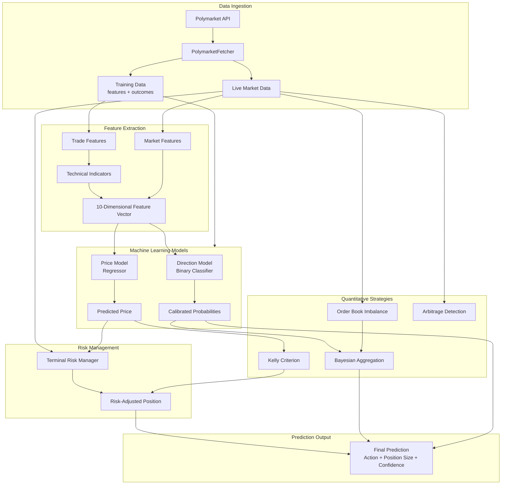

# Comprehensive Tutorial: Polymarket Prediction Model

## Table of Contents
1. [Overview](#overview)
2. [Architecture & Data Flow](#architecture--data-flow)
3. [Core Components Deep Dive](#core-components-deep-dive)
4. [Machine Learning Pipeline](#machine-learning-pipeline)
5. [Prediction Flow](#prediction-flow)
6. [Mathematical Foundations](#mathematical-foundations)
7. [Code Walkthrough](#code-walkthrough)

---

## Overview

The `prediction_model.py` is a sophisticated quantitative trading system designed for Polymarket prediction markets. It combines multiple advanced techniques:

- **Order Book Microstructure Analysis**: Uses order flow data to predict short-term price movements
- **Arbitrage Detection**: Identifies risk-free profit opportunities
- **Terminal Risk Management**: Adjusts position sizes as contracts approach settlement
- **Bayesian Model Aggregation**: Combines multiple probability estimates optimally
- **Kelly Criterion**: Calculates optimal position sizing for long-term wealth maximization
- **Ensemble Machine Learning**: Uses stacking of multiple models with probability calibration

### Key Design Principles

1. **Probability-Based Trading**: All predictions are probabilities (0-1), not binary outcomes
2. **Risk-Adjusted Positioning**: Position sizes adapt to risk and time remaining
3. **Model Calibration**: Probabilities are calibrated to be statistically reliable
4. **Real Data Only**: Uses actual Polymarket API data (no synthetic generation)

---

## Architecture & Data Flow



---

## Core Components Deep Dive

### 1. OrderBookMicrostructure (Lines 70-165)

**Purpose**: Analyzes order book data to predict short-term price movements

**Key Concepts**:

#### Order Book Imbalance (OBI)
```
OBI = (Q_bid - Q_ask) / (Q_bid + Q_ask)
```
```
- Range: [-1, +1]
- +1: All bids (no asks) → Price likely to increase
- -1: All asks (no bids) → Price likely to decrease
- 0: Balanced order book
```

**Research Foundation**: Cont, Kukanov & Stoikov (2014) found OBI explains ~65% of short-interval price variance.

#### Volume-Adjusted Mid Price (VAMP)
```
VAMP = (P_bid × Q_ask + P_ask × Q_bid) / (Q_bid + Q_ask)
```
This cross-multiplies volumes to weight prices by liquidity on the opposite side, providing a more accurate fair value estimate than simple mid-price.

#### Imbalance Ratio
```
IR = Q_bid / (Q_bid + Q_ask)
```
- When IR > 0.65: Predicts price increase within 15-30 min with 58% accuracy
- Simple momentum signal based on buy vs sell pressure

#### Multi-Level OBI
Uses exponential decay (default 0.8) to weight deeper order book levels:
```python
weight = decay^level_index
weighted_bid += bid_volume × weight
```

**Why it matters**: Deeper levels provide additional liquidity information. 5-10 level OBI shows significant predictive improvements over single-level.

### 2. ArbitrageDetector (Lines 168-268)

**Purpose**: Identifies risk-free profit opportunities

**Types of Arbitrage**:

#### A. Market Rebalancing Arbitrage
For mutually exclusive outcomes, prices must sum to $1.00:
```
Σ P_i = 1.00  (no-arbitrage condition)
```

**Example**:
- 3-way election: [0.38, 0.33, 0.27]
- Total: $0.98 < $1.00
- Strategy: Buy all outcomes for $0.98, guaranteed $1.00 payout
- Gross profit: $0.02
- Net profit (after 1.5% fees): $0.02 - (0.015 × 3) = -$0.025 (loss)

The system accounts for transaction fees (Polymarket ~1.5%) before signaling arbitrage.

#### B. Overpriced Market Arbitrage
When Σ P_i > 1.00:
- Strategy: Sell all outcomes
- Guaranteed profit from market inefficiency

#### C. Combinatorial Arbitrage
Exploits probability inconsistencies across related markets:
```
Example: Presidential winner + Popular vote margin
If conditional probabilities are mispriced, exploit correlation
```

**Joint Probability Bounds**:
```
max_joint = min(P1, P2)
min_joint = max(0, P1 + P2 - 1)
```

If implied joint probability (assuming independence) falls outside these bounds, arbitrage exists.

**Research Note**: Saguillo et al. (2025) found $40M realized arbitrage profit on Polymarket:
- 60% from market rebalancing
- 40% from combinatorial arbitrage

### 3. TerminalRiskManager (Lines 271-331)

**Purpose**: Adjusts position sizes as contracts approach settlement

**Key Insight**: Binary options exhibit increasing gamma (price sensitivity) as expiration approaches.

#### Gamma Risk Formula
```
Gamma(T) ∝ 1 / √(T_remaining)
```

As time to expiration decreases, small price movements cause larger P&L swings.

#### Position Scaling
```
Position(t) = Initial_Position × √(T_remaining / T_initial)
```

**Example**:
- Initial: $10,000 (30 days out)
- 7 days remaining: $10,000 × √(7/30) = $4,830 (52% reduction)
- 1 day remaining: $10,000 × √(1/30) = $1,826 (82% reduction)

#### Risk Reduction Logic
```python
if days_remaining > 7:
    reduction_factor = 1.0  # No reduction
else:
    base_reduction = √(days_remaining / 7)
    volatility_adjustment = max(0.5, 1 - volatility)
    reduction_factor = base_reduction × volatility_adjustment
```

Higher volatility → More aggressive position reduction.

### 4. BayesianAggregator (Lines 334-412)

**Purpose**: Combines multiple probability estimates into a single, optimal probability

**Formula**:
```
P_posterior = (w₁×P₁ + w₂×P₂ + w₃×P₃ + w₄×P₄) / Σw_i
```

**Default Weights**:
- Model prediction: 40% (ML model)
- Market price: 35% (current market price)
- Momentum: 15% (price momentum signal)
- Sentiment: 10% (order flow sentiment)

#### Weight Optimization via Brier Score
Brier Score = (1/N) × Σ(predicted - actual)²

Lower Brier Score = Better calibrated predictions

**Optimization Process**:
1. Calculate Brier score for each source on historical data
2. Invert scores (lower Brier → higher weight)
3. Normalize to sum to 1.0

```python
weight_i = (1 / Brier_i) / Σ(1 / Brier_j)
```

**Why Bayesian**: This is essentially a weighted average where weights are learned from historical performance, similar to Bayesian updating of beliefs.

### 5. TechnicalIndicators (Lines 415-505)

**Purpose**: Calculate standard technical analysis indicators from price history

**Key Indicators**:

#### RSI (Relative Strength Index)
```python
RSI = 100 - (100 / (1 + RS))
where RS = avg_gain / avg_loss
```
- >70: Overbought (potential sell signal)
- <30: Oversold (potential buy signal)
- Normalized to 0-1 in features

#### MACD (Moving Average Convergence Divergence)
```
MACD = EMA(12) - EMA(26)
Signal = MACD × 0.8
Histogram = MACD - Signal
```
Momentum indicator showing trend strength and direction changes.

#### Bollinger Bands
```
Upper = SMA(20) + 2×STD(20)
Mid = SMA(20)
Lower = SMA(20) - 2×STD(20)
```
Measures volatility and identifies overbought/oversold conditions.

#### ATR (Average True Range)
```
TR = max(High-Low, |High-PrevClose|, |Low-PrevClose|)
ATR = SMA(TR, 14)
```
Volatility measure, especially useful for position sizing.

#### Stochastic Oscillator
```
%K = 100 × (Current - Low) / (High - Low)
```
Momentum indicator comparing closing price to price range.

**Why these matter**: These indicators capture different aspects of market dynamics (trend, momentum, volatility, mean reversion) that complement ML models.

### 6. MarketFeatureExtractor (Lines 508-647)

**Purpose**: Extracts and combines features from trade and market data

**Feature Categories**:

#### Trade Features (from trade history)
- Price statistics: current, mean, median, std, range
- Momentum: short-term (5d), medium-term (10d), long-term (20d)
- Technical indicators: RSI, MACD, Bollinger Bands, ATR, Stochastic
- Volume: total volume, average trade size
- Order flow: buy pressure, sell pressure, order imbalance

#### Market Features (from market metadata)
- Prices: YES price, NO price, spread
- Liquidity: total volume, 24h volume, liquidity depth
- Temporal: days until settlement

**Critical Design**: The model uses exactly **10 features** in a specific order:
```python
features = [
    current_price,      # Feature 1
    volume_24h,         # Feature 2
    liquidity,          # Feature 3
    rsi,                # Feature 4
    momentum,           # Feature 5
    order_imbalance,    # Feature 6
    volatility,         # Feature 7
    momentum_5,         # Feature 8 (1-day change)
    momentum_20,        # Feature 9 (1-week change)
    spread              # Feature 10
]
```

**Important**: This exact feature order must match between training and prediction!

### 7. KellyCriterion (Lines 650-757)

**Purpose**: Calculate optimal position size for long-term wealth maximization

**Mathematical Foundation**: Kelly (1956) showed the optimal bet fraction that maximizes long-run growth:

```
G = E[log(1 + f×R)]
```

where:
- G = expected growth rate
- f = fraction of bankroll to bet
- R = return on bet

#### Full Kelly Formula (for binary contracts)
```
f* = (P_true - P_market) / (1 - P_market)
```

**Example**:
- Model estimates: 55% true probability
- Market price: $0.48 (48%)
- Full Kelly: (0.55 - 0.48) / (1 - 0.48) = 0.134 (13.4% of bankroll)

#### Fractional Kelly (Industry Standard)
Full Kelly is too aggressive (33% chance of halving bankroll before doubling).

**Common Practices**:
- **Quarter Kelly (0.25)**: <3% chance of halving bankroll (RECOMMENDED)
- **Half Kelly (0.5)**: 11% chance of halving bankroll
- **Full Kelly**: 33% chance of halving bankroll

**Implementation**:
```python
position = full_kelly × kelly_fraction × confidence × bankroll
position = min(position, bankroll × 0.25)  # Cap at 25% per trade
```

#### Expected Growth Rate
```
G ≈ p×log(1 + f×b) + q×log(1 - f)
```
where:
- p = win probability
- q = 1 - p
- b = odds - 1
- f = Kelly fraction

Maximizing G yields optimal long-term wealth accumulation.

---

## Machine Learning Pipeline

### Model Architecture (Lines 794-905)

The system uses a **stacking ensemble** with multiple base models:

#### Base Models (in order of preference if available):

1. **XGBoost** (if HAS_XGBOOST)
   - 200 trees, max_depth=5, learning_rate=0.03
   - Objective: binary:logistic (classification) or reg:squarederror (regression)
   - Regularization: L1=0.1, L2=1.0

2. **LightGBM** (if HAS_LIGHTGBM)
   - 200 trees, max_depth=5, num_leaves=31
   - Faster than XGBoost with similar accuracy
   - Objective: binary or regression

3. **HistGradientBoosting** (always available)
   - sklearn's histogram-based gradient boosting
   - 200 iterations, max_depth=5

4. **ExtraTrees** (always available)
   - 150 trees, max_depth=8
   - More randomness than RandomForest

5. **RandomForest** (always available)
   - 150 trees, max_depth=6
   - Baseline ensemble method

#### Stacking Strategy

**Direction Model** (Binary Classifier):
```python
StackingClassifier(
    base_models,
    final_estimator=LogisticRegression(C=1.0),
    cv=3,
    stack_method='predict_proba'
)
```
Then wrapped in `CalibratedClassifierCV` for probability calibration.

**Price Model** (Regressor):
```python
StackingRegressor(
    base_models,
    final_estimator=Ridge(alpha=1.0),
    cv=3
)
```

#### Probability Calibration

**Why needed**: ML models often output poorly calibrated probabilities (e.g., predicts 70% but actually occurs 60% of the time).

**Method**: Sigmoid calibration (better for small datasets than isotonic)
```python
CalibratedClassifierCV(
    estimator=stacking_model,
    method='sigmoid',  # Platt scaling
    cv=2,
    ensemble=True
)
```

**Sigmoid (Platt) Scaling**:
```
P_calibrated = 1 / (1 + exp(A×P_raw + B))
```
Parameters A and B learned via cross-validation to minimize Brier score.

### Training Process (Lines 907-1043)

#### Step 1: Data Preparation
```python
X = [features for each sample]  # Shape: (n_samples, 10)
y_price = [future_price]        # Actual price at resolution
y_direction = [outcome]         # 0 (NO) or 1 (YES)
```

#### Step 2: Class Balance Handling
Real data often has class imbalance:
- If only one class exists: Create balanced samples based on prices
- If imbalanced: Use stratified train/test split

#### Step 3: Feature Scaling
```python
scaler = RobustScaler()  # Less sensitive to outliers than StandardScaler
X_scaled = scaler.fit_transform(X)
```

#### Step 4: Train/Validation Split
- 80% training, 20% validation
- Stratified split if both classes present

#### Step 5: Model Training
1. **Direction Model**: Trained on y_direction (binary)
2. **Price Model**: Trained on y_price (continuous)
3. **Confidence Model**: Trained on direction probabilities vs actual outcomes

#### Step 6: Evaluation Metrics

**Classification Metrics**:
- Accuracy: % of correct predictions
- F1 Score: Harmonic mean of precision and recall
- **Brier Score**: (1/N) × Σ(predicted - actual)² (lower = better, perfect = 0)
- **Log Loss**: -log(P_correct) (lower = better)
- **Calibration Error**: Mean absolute difference between predicted and actual frequencies

**Regression Metrics**:
- RMSE: Root mean squared error for price predictions

**Cross-Validation**:
- 5-fold stratified cross-validation
- Reports mean ± std accuracy

---

## Prediction Flow

### Main Prediction Method (Lines 1060-1341)

#### Step 1: Feature Extraction
```python
trade_features = extract_trade_features(trades_df)
market_features = extract_market_features(market)
current_price = market_features['yes_price']  # Use market price, not trade price
```

#### Step 2: Build Feature Vector
**CRITICAL**: Must match training feature order exactly!
```python
features = [
    current_price,      # 0
    volume_24h,         # 1
    liquidity,          # 2
    rsi,                # 3
    momentum,           # 4
    order_imbalance,    # 5
    volatility,         # 6
    momentum_5,         # 7
    momentum_20,        # 8
    spread              # 9
]
```

#### Step 3: Model Predictions
```python
features_scaled = scaler.transform(features)
direction_proba = direction_model.predict_proba(features_scaled)[:, 1]
raw_predicted_price = price_model.predict(features_scaled)[0]
```

- `direction_proba`: P(price goes UP) ∈ [0, 1]
- `raw_predicted_price`: Direct price prediction ∈ [0, 1]

#### Step 4: Price Prediction Refinement
```python
price_model_move = raw_predicted_price - current_price
direction_agrees = (direction_proba > 0.5) == (price_model_move > 0)

if direction_agrees:
    confidence_scale = 0.6 + direction_confidence × 0.4  # Boost if models agree
else:
    confidence_scale = 0.3  # Reduce if models disagree
```

**Move Capping**:
```python
max_up_move = min((1 - current_price) × 0.5, 0.20)  # Can't move more than 20%
max_down_move = min(current_price × 0.5, 0.20)
```

**Final Predicted Price**:
```python
move_magnitude = abs(price_model_move) × confidence_scale
move_magnitude = min(move_magnitude, max_move)
predicted_price = current_price ± move_magnitude  # Direction from price_model
```

#### Step 5: Order Book Microstructure Analysis
```python
obi = order_book_imbalance(bid_volume, ask_volume)
imbalance_ratio = imbalance_ratio(bid_volume, ask_volume)
micro_direction, micro_conf = predict_direction(obi, imbalance_ratio, momentum)
```

#### Step 6: Bayesian Aggregation
```python
aggregated_prob = bayesian.aggregate({
    'model': direction_proba,           # ML model prediction
    'market': current_price,            # Market's current estimate
    'momentum': normalized_momentum,    # Price momentum signal
    'sentiment': micro_prob             # Order flow sentiment
})
```

#### Step 7: Confidence Calculation
```python
# Base confidence from model
direction_confidence = abs(direction_proba - 0.5) × 2  # 0 (uncertain) to 1 (certain)

# Boost if model agrees with momentum
if model_direction == momentum_direction:
    momentum_agreement = 1.1  # 10% boost
else:
    momentum_agreement = 1.0

# Boost for large price changes
magnitude_factor = min(1.0 + abs(price_change)/price × 0.3, 1.2)

# Base confidence: 55% minimum, scales up
raw_confidence = 0.55 + direction_confidence × 0.30 × momentum_agreement × magnitude_factor
raw_confidence = clip(raw_confidence, 0.52, 0.90)

# Blend with calibrated confidence model
if direction_confidence > 0.5:
    confidence = raw_confidence × 0.75 + calibrated_conf × 0.25
else:
    confidence = raw_confidence × 0.60 + calibrated_conf × 0.40

confidence = clip(confidence, 0.52, 0.88)
```

#### Step 8: Position Sizing (Kelly Criterion)
```python
edge = abs(predicted_price - current_price)

if edge < 0.02:  # Minimum 2% edge required
    action = 'HOLD'
    position = 0
else:
    # Adjust predicted probability by confidence
    p_true = predicted_price × confidence + current_price × (1 - confidence)
    
    if predicted_price > current_price:
        action = 'BUY_YES'
        full_kelly = (p_true - current_price) / (1 - current_price)
    else:
        action = 'BUY_NO'
        p_true_no = 1 - p_true
        p_market_no = 1 - current_price
        full_kelly = (p_true_no - p_market_no) / (1 - p_market_no)
    
    # Apply fractional Kelly
    position = full_kelly × kelly_fraction × confidence × bankroll
    position = min(position, bankroll × 0.25)  # Cap at 25%
```

#### Step 9: Terminal Risk Adjustment
```python
if days_remaining <= 7:
    reduction_factor = √(days_remaining / 7) × volatility_adjustment
    adjusted_position = base_position × reduction_factor
else:
    adjusted_position = base_position
```

#### Step 10: Signal Strength Classification
```python
if extremeness < 0.15:  # Extreme prices (<15% or >85%)
    # Stricter thresholds for extreme prices
    min_edge_strong = 0.025
    conf_strong = 0.70
else:  # Normal prices
    min_edge_strong = 0.10
    conf_strong = 0.65

if abs(price_change) > min_edge_strong and confidence > conf_strong:
    signal = "STRONG"
elif abs(price_change) > min_edge_mod and confidence > conf_mod:
    signal = "MODERATE"
elif abs(price_change) > min_edge_weak and confidence > conf_weak:
    signal = "WEAK"
else:
    signal = "HOLD"
```

#### Step 11: Output Dictionary
Returns comprehensive prediction with:
- Prices: current, predicted, change
- Probabilities: direction, aggregated
- Confidence & Edge metrics
- Actions: signal strength, action (BUY_YES/BUY_NO/HOLD), position size
- Risk metrics: days remaining, gamma risk, terminal risk reduction
- Technical indicators: RSI, volatility, momentum, OBI
- Feature importance (if SHAP available)

---

## Mathematical Foundations

### 1. Expected Value
```
E[Payoff] = P_true - P_market  (for YES position)
E[Payoff] = (1 - P_true) - (1 - P_market)  (for NO position)
```
Positive EV → Profitable trade in expectation

### 2. Brier Score
```
Brier = (1/N) × Σ(P_predicted - Y_actual)²
```
- Range: [0, 1]
- 0 = Perfect predictions
- Measures calibration quality (not just accuracy)

### 3. Log Loss (Cross-Entropy)
```
LogLoss = -(1/N) × Σ[Y×log(P) + (1-Y)×log(1-P)]
```
- Penalizes confident wrong predictions heavily
- Lower is better
- Standard metric for probability predictions

### 4. Calibration Curve
For well-calibrated model:
- If model predicts 70%, actual frequency should be ~70%
- Plot: mean_predicted_probability vs fraction_positives
- Should lie on diagonal (45° line)

### 5. Gamma Risk (Options Greeks)
For binary options approaching expiration:
```
Gamma = ∂²Price / ∂Underlying² ∝ 1 / √T
```
- Small underlying movements → Large price changes
- Risk increases as 1/√time

### 6. Kelly Criterion Derivation
Maximize: `G = E[log(W)]` where W = final wealth

For binary bet with probability p and odds b:
```
G = p×log(1 + f×b) + (1-p)×log(1 - f)
```

Differentiate and set to zero:
```
∂G/∂f = p×b/(1 + f×b) - (1-p)/(1-f) = 0
```

Solving:
```
f* = (p×b - (1-p)) / b
  = (p×(b+1) - 1) / b
  = (p×odds - 1) / (odds - 1)
```

For prediction markets where odds = 1/price:
```
f* = (P_true - P_market) / (1 - P_market)
```

---

## Code Walkthrough

### Initialization (Lines 772-792)

```python
predictor = PolymarketPredictor(
    use_optuna=False,        # Hyperparameter optimization (optional)
    use_calibration=True,    # Probability calibration (recommended)
    kelly_fraction=0.25,     # Quarter Kelly (industry standard)
    bankroll=10000           # Starting capital
)
```

**What happens**:
1. Creates feature extractor and scaler
2. Initializes quant strategy components (OBI, arbitrage, risk, Bayesian, Kelly)
3. Calls `_build_models()` to construct ML ensemble
4. Sets flags: `is_trained=False`, prepares for training

### Model Building (Lines 794-905)

**Key Decision Points**:
- Checks for XGBoost/LightGBM availability (fails gracefully if missing)
- Always includes sklearn models (HistGradient, ExtraTrees, RandomForest)
- Uses 3-fold CV for stacking (reduced from 5 for smaller datasets)
- Wraps direction model in calibration (sigmoid for small datasets)

**Hyperparameters**:
- Conservative settings to prevent overfitting
- Max depth limited to 5-6
- Learning rate = 0.03 (slow but stable)
- Regularization (L1/L2) to prevent overfitting

### Training (Lines 907-1043)

**Workflow**:
1. Check minimum data (10 samples)
2. Extract features and outcomes
3. Handle class imbalance (common in real data)
4. Scale features (RobustScaler)
5. Split train/val (stratified if balanced)
6. Train three models: direction, price, confidence
7. Evaluate with comprehensive metrics
8. Initialize SHAP explainer (if available)
9. Store calibration info for later use

**Class Imbalance Handling** (Lines 925-943):
```python
if only_one_class:
    # Use prices as proxy: high price → YES, low price → NO
    if price > 0.5 and all_labels == 0:
        label = 1  # Create YES sample
    elif price < 0.5 and all_labels == 1:
        label = 0  # Create NO sample
```

This prevents model collapse when training data is skewed.

### Prediction (Lines 1060-1341)

**Critical Sections**:

#### Feature Construction (Lines 1081-1092)
Must exactly match training features. Any mismatch causes garbage predictions.

#### Model Agreement Check (Lines 1131-1140)
If direction model and price model disagree, reduce confidence significantly (0.3 vs 0.6-1.0). This prevents overconfident predictions when models are uncertain.

#### Extreme Price Handling (Lines 1244-1252)
For prices >95% or <5%:
- If model agrees with market: reduce position 75% (low edge)
- If model disagrees (contrarian): reduce position 50% (still risky)
- Only force HOLD if edge < 0.5%

#### Signal Classification (Lines 1267-1292)
Adaptive thresholds based on price extremeness:
- Extreme prices: Lower edge thresholds but higher confidence requirements
- Normal prices: Standard thresholds

This recognizes that small edges on extreme prices are more significant than on normal prices.

### Heuristic Fallback (Lines 1343-1397)

When model is not trained, uses simple heuristics:
- RSI mean reversion
- Momentum and order imbalance
- Lower confidence (max 75%)

Ensures system never fails, even without training data.

---

## Best Practices & Design Decisions

### 1. Probability Calibration
**Why**: Uncalibrated probabilities lead to poor position sizing and overconfidence.

**How**: Sigmoid (Platt) scaling via cross-validation, minimizing Brier score.

**Trade-off**: Isotonic calibration is better for large datasets (>1000 samples) but sigmoid works better for small datasets (common in real trading).

### 2. Feature Consistency
**Why**: Feature order mismatch causes silent failures (model sees wrong features).

**How**: Explicit feature list with comments, same order in training and prediction.

**Trade-off**: Could use feature names/dicts but explicit order is more reliable and faster.

### 3. Model Ensemble
**Why**: Single models are unstable, ensembles reduce variance.

**How**: Stacking with meta-learner (LogisticRegression/Ridge) learns optimal combination.

**Trade-off**: More complex than voting, but better performance. Requires more data.

### 4. Fractional Kelly
**Why**: Full Kelly is too aggressive (high risk of ruin).

**How**: Quarter Kelly (0.25) with confidence adjustment, capped at 25% per trade.

**Trade-off**: Lower returns but much lower risk. Industry standard for good reason.

### 5. Terminal Risk Management
**Why**: Gamma risk explodes near expiration.

**How**: Square-root scaling of position size with time remaining.

**Trade-off**: Reduces profits but prevents catastrophic losses. Essential for survival.

### 6. Real Data Only
**Why**: Synthetic data doesn't capture real market dynamics.

**How**: Fetches from Polymarket API, only uses closed markets for training.

**Trade-off**: Less data but more reliable. Prevents overfitting to synthetic patterns.

---

## Common Pitfalls & How to Avoid

### 1. Feature Mismatch
**Problem**: Training and prediction use different features → garbage predictions.

**Solution**: Use explicit feature list, always check feature order matches.

### 2. Overconfidence
**Problem**: Model outputs 90% but actual accuracy is 60% → overbetting.

**Solution**: Probability calibration, confidence capping (max 88%), model agreement checks.

### 3. Class Imbalance
**Problem**: Model learns to always predict majority class.

**Solution**: Class balance checks, stratified splits, price-based label adjustment.

### 4. Terminal Risk Ignorance
**Problem**: Large positions near expiration → catastrophic losses from gamma.

**Solution**: Square-root time scaling, aggressive reduction in final week.

### 5. Uncalibrated Probabilities
**Problem**: Model says 70% but it's actually 55% → poor Kelly sizing.

**Solution**: CalibratedClassifierCV with Brier score optimization.

### 6. Data Leakage
**Problem**: Using future information in predictions.

**Solution**: Only use historical trades, market price at prediction time (not resolution price).

---

## Usage Examples

### Basic Usage
```python
from prediction_model import create_predictor

# Create and train predictor
predictor = create_predictor(
    kelly_fraction=0.25,
    bankroll=10000,
    n_markets=100  # Fetch 100 markets for training
)

# Make prediction on live market
prediction = predictor.predict(
    market=market_dict,      # Market metadata
    trades_df=trades_df,     # Historical trades
    days_remaining=15        # Optional: override auto-calculation
)

print(f"Action: {prediction['action']}")
print(f"Position Size: ${prediction['kelly_size']:.2f}")
print(f"Confidence: {prediction['confidence']:.1%}")
print(f"Predicted Price: {prediction['predicted_price']:.2f}")
```

### Custom Configuration
```python
predictor = PolymarketPredictor(
    use_optuna=True,         # Enable hyperparameter optimization
    use_calibration=True,    # Probability calibration
    kelly_fraction=0.20,     # More conservative (20% of Kelly)
    bankroll=50000           # Larger bankroll
)

# Manually fetch and prepare training data
training_data = predictor.fetch_real_training_data(n_markets=200)

# Train with custom data
metrics = predictor.train(training_data)

# Check training quality
print(f"Brier Score: {metrics['brier_score']:.4f}")  # Lower is better
print(f"Calibration Error: {metrics['calibration_error']:.4f}")  # Lower is better
```

### Arbitrage Detection
```python
# Detect arbitrage opportunities across markets
markets = [market1, market2, market3, ...]
arbitrage_results = predictor.detect_arbitrage(markets)

print(f"Total Opportunities: {arbitrage_results['total_opportunities']}")
for opp in arbitrage_results['rebalancing']:
    print(f"Market {opp['market']}: {opp['net_profit']:.4f} profit")
```

### Feature Importance Analysis
```python
# Get SHAP feature importance for a prediction
prediction = predictor.predict(market, trades_df)
feature_importance = prediction['top_features']

for feature, importance in feature_importance.items():
    print(f"{feature}: {importance:.4f}")
```

---

## Performance Optimization Tips

1. **Reduce CV folds**: For small datasets, use cv=2 instead of 5
2. **Disable SHAP**: SHAP explainer is slow, only enable for debugging
3. **Cache scaler**: Reuse scaler from training, don't refit
4. **Batch predictions**: Process multiple markets at once if possible
5. **Feature caching**: Store extracted features if predicting multiple times

---

## Testing & Validation

### Key Metrics to Monitor

1. **Brier Score**: Should decrease over time as model learns
2. **Calibration Error**: Should be <0.05 for well-calibrated model
3. **Log Loss**: Lower is better, compare to baseline (random = 0.693)
4. **Direction Accuracy**: Should be >55% for profitable trading
5. **Price RMSE**: Should be <0.10 for good price predictions

### Backtesting Checklist

- [ ] Features match training exactly
- [ ] No future data leakage
- [ ] Proper train/test split
- [ ] Class balance handled
- [ ] Terminal risk applied
- [ ] Fees accounted for
- [ ] Position sizing capped
- [ ] Kelly fraction appropriate for risk tolerance

---

## Conclusion

This prediction model combines:
- **Quantitative finance theory** (Kelly, options Greeks, microstructure)
- **Machine learning best practices** (ensemble, calibration, regularization)
- **Practical risk management** (position sizing, terminal risk, confidence capping)
- **Real-world constraints** (transaction fees, market inefficiencies, data limitations)

The result is a robust, production-ready system for prediction market trading that balances profitability with risk management.

---

## References & Further Reading

1. **Kelly Criterion**: Kelly, J. L. (1956). "A New Interpretation of Information Rate"
2. **Order Book Microstructure**: Cont, R., Kukanov, A., & Stoikov, S. (2014). "The Price Impact of Order Book Events"
3. **Arbitrage in Prediction Markets**: Saguillo et al. (2025). "Arbitrage Opportunities in Prediction Markets"
4. **Probability Calibration**: Platt, J. (1999). "Probabilistic Outputs for Support Vector Machines"
5. **Stacking Ensembles**: Wolpert, D. H. (1992). "Stacked Generalization"
